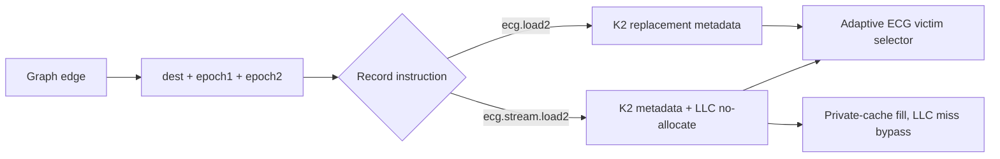

# ECG Cache Architecture Artifact

This branch is the implementation and reproducibility artifact for the successor
to **ECG: Expressing Locality and Prefetching for Optimal Caching in Graph
Structures** (IEEE IPDPSW 2024).

The new architecture adds:

- **K2** two-future-reference edge records;
- traversal-adaptive graph-cache replacement;
- **StreamShield** request-bound LLC placement control;
- RISC-V PR `ecg.load2` and `ecg.stream.load2` plus BFS `ecg.extract2`;
- cache_sim, gem5, and Sniper implementations with exact equivalence gates.

The public HPCA paper name remains open. Implementation names remain `ECG_*`.

## Architecture at a glance



K2 uses one 64-bit record:

```text
| epoch2:16 | epoch1:16 | destination:32 |
```

For current epoch `c`, each candidate property line is assigned the nearer of
its two circular future-reference distances. PR uses epoch-first eviction and
BFS uses degree-first with K2 tie-breaking. First-class K2 labels are rejected
for other kernels until pair delivery and traffic accounting are complete.
StreamShield preserves private-cache fills and LLC hits while suppressing only
LLC allocation after a record miss.

StreamShield is request-bound. Current gem5 K2 pair delivery uses the validated
in-order mailbox path; a request-bound pair extension is required before O3.

Full architecture diagrams and a worked example are in
[`research/ecg-hpca/ARCHITECTURE.md`](research/ecg-hpca/ARCHITECTURE.md).

## Policy comparison

| Policy | Guidance | Reserved LLC ways | LLC placement |
|---|---|---:|---|
| LRU | recency | 0 | normal |
| SRRIP | generic rereference interval | 0 | normal |
| GRASP | degree/address hotness | 0 | normal |
| P-OPT | live rereference matrix | charged | normal |
| ECG K2 | degree + RRIP + two edge-carried epochs | 0 | normal |
| ECG K2+StreamShield | K2 plus request-bound placement | 0 | no-allocate on record miss |

## Repository map

| Path | Purpose |
|---|---|
| `research/ecg-hpca/` | Paper SSOT, claim ledger, methodology, results, runbook |
| `research/ecg-hpca/evidence/` | Historical ECG experiments and audit evidence |
| `scripts/experiments/ecg/` | Canonical experiment, verification, analysis, and Slurm package |
| `bench/include/cache_sim/` | Functional cache hierarchy and ECG policy |
| `bench/include/gem5_sim/` | gem5 configs, overlays, and ISA support |
| `bench/include/sniper_sim/` | Sniper configs, overlays, and fused K2 model |
| `bench/src_sim/` | cache_sim-instrumented graph kernels |
| `bench/src_gem5/` | gem5 graph kernels |
| `bench/src_sniper/` | Sniper kernels and bounded SIFT workload |
| `wiki/ECG-HPCA-Paper.md` | Minimal public-facing status page |

## Setup

```bash
make setup-gem5
make setup-sniper
make all-sim
make gem5-riscv-m5ops-pr gem5-riscv-m5ops-bfs
make sniper-sg_kernel
```

RISC-V gem5 builds additionally require a RISC-V cross compiler.

## Correctness gates

```bash
pytest -q scripts/test

python3 scripts/experiments/ecg/verify/equiv_kernels.py \
  --gem5 --sniper --kernels pr bfs --schedule-k 2

python3 scripts/experiments/ecg/verify/equiv_kernels.py \
  --gem5 --sniper --kernels pr --schedule-k 2 --stream-bypass
```

## Paper matrix

Every reported comparison includes:

```text
LRU  SRRIP  GRASP  charged P-OPT  K2  K2+StreamShield
```

The cache_sim factorial additionally exposes `ECG:K1` and
`ECG:K1_STREAMSHIELD`.

```bash
python3 scripts/experiments/ecg/flows/paper_run.py \
  --profile streamshield_sniper_realgraph \
  --run-dir results/ecg_experiments/final_paper_runs/ecg_successor_webgoogle \
  --no-build
```

See [`research/ecg-hpca/RUNBOOK.md`](research/ecg-hpca/RUNBOOK.md) for local,
Slurm, and aggregation workflows.

## Reproduction profiles

| Profile | Purpose |
|---|---|
| `ecg_smoke` | Fast six-policy cache_sim check |
| `ecg_cache_sim_factorial` | Real-graph K1/K2 x StreamShield attribution |
| `gem5_streamshield_mechanism` | RISC-V request-bound mechanism cell |
| `sniper_streamshield_mechanism` | Fused K2/StreamShield timing mechanism cell |
| `streamshield_sniper_realgraph` | Bounded web-Google paper matrix |

## Prior-publication boundary

The IPDPSW 2024 ECG paper is archival. An HPCA submission must be materially
different, cite the workshop paper, disclose the contribution delta, and receive
PC-chair guidance before registration. See
[`research/ecg-hpca/CHAIR_QUERY.md`](research/ecg-hpca/CHAIR_QUERY.md).

Generated `results/`, simulator checkouts, binaries, traces, and graph files are
ignored and must not be committed.
