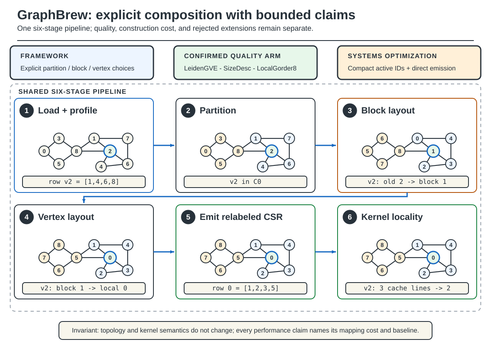

[<p align="center"></p>](#graphbrew)

# GraphBrew

GraphBrew is a C++17/OpenMP framework for **composable vertex reordering**.
Its purpose is to study and deploy the trade-off between:

- the cost of constructing a new vertex layout; and
- the graph-kernel locality obtained from that layout.

GraphBrew does not hide this trade-off behind one algorithm name. It records
three explicit decisions:

| Decision | Examples | Purpose |
|---|---|---|
| Partitioner | Leiden, Rabbit | discover vertex groups |
| Block layout | identity, size/degree sort, super-graph order | place groups globally |
| Vertex layout | BFS, RCM, degree order, Gorder | order vertices inside each block |



## Manual composition versus automatic selection

GraphBrew has two distinct interfaces.

### Explicit composition

Algorithm 12 executes the exact configuration supplied by the user:

```bash
./bench/bin/pr -f graph.sg -s \
  -o '12:leiden:compose:sg_none:comm_size_desc:intra_gorder:gw8' \
  -n 3
```

This path is **hand configured**. GraphBrew does not search compositions at
runtime. It is used for controlled experiments and for applications that
already know their desired layout.

### Frozen low-reuse policy

Algorithm 14 can apply one validated deterministic rule:

```bash
./bench/bin/pr -f graph.sg -s \
  -o '14:_:_:_:allkernel-lowreuse-rule:best-endtoend:1' \
  -n 3
```

This current deployed policy is **not machine learning**. It uses cheap graph
statistics, machine LLC capacity, kernel identity, and an explicit reuse count
to choose between:

- the promoted FastLeiden-Gorder8 composition; and
- Boost Rabbit.

There is no runtime training, graph-name lookup, database oracle, or trial of
multiple reorderers.

## Validated low-reuse result

The promoted composition is:

```text
12:leiden:compose:sg_none:comm_size_desc:intra_gorder:gw8:
cd_parallel:sgmb4096:gordf5000:norefine:2:2
```

It uses two parallel Leiden iterations and passes, ordered super-graph
proposal batches, SizeDesc block placement, Gorder8 for communities up to
5000 vertices, and BFS fallback for larger communities.

The rule was derived on 18 graphs and frozen before 12 additional graphs were
opened. It selected GraphBrew on seven holdouts and Boost Rabbit on five.

| Reuse | Selected holdouts: Boost/GraphBrew | Lower 95% | Full selector/always-Boost |
|---:|---:|---:|---:|
| 1 | 1.696x | 1.502x | 1.361x |
| 2 | 1.642x | 1.460x | 1.336x |

Scope:

- kernels: PR, PR-SpMV, BFS, CC, CC-SV, BC, and SSSP;
- mapping reuse: 1 or 2, supplied explicitly;
- fallback: Boost Rabbit;
- known limitation: CC-SV can regress even when aggregate end-to-end time
  improves.

See the
[architecture and evidence guide](https://github.com/UVA-LavaLab/GraphBrew/wiki/All-Kernel-Low-Reuse-Selector)
and [`docs/allkernel-lowreuse-evidence.json`](docs/allkernel-lowreuse-evidence.json).

## Build

```bash
# Dependency check
python3 scripts/graphbrew_experiment.py --check-deps

# Standard build
make -j"$(nproc)" all

# Core validation
make check
```

Boost Rabbit requires the standard dependency-enabled build. A reduced build
is available with `RABBIT_ENABLE=0`.

## Run a benchmark

```bash
# Input layout
./bench/bin/pr -f graph.sg -s -o 0 -n 3

# Rabbit baselines
./bench/bin/pr -f graph.sg -s -o 8:csr -n 3
./bench/bin/pr -f graph.sg -s -o 8:boost -n 3

# Explicit GraphBrew composition
./bench/bin/bfs -f graph.sg -s \
  -o '12:leiden:compose:sg_none:comm_size_desc:intra_gorder:gw8' \
  -n 3

# Frozen reuse-2 policy
./bench/bin/bfs -f graph.sg -s \
  -o '14:_:_:_:allkernel-lowreuse-rule:best-endtoend:2' \
  -n 3
```

`reuse=2` means one materialized mapping is used by two separate kernel
invocations. It does not mean two internal PageRank iterations.

## Reproducible experiments

Use `scripts/graphbrew_experiment.py` as the public orchestration entry point.
Large graphs, mappings, and result artifacts belong under:

```text
/media/Data/00_GraphDatasets/GraphBrew
```

Rapid checks are for debugging and candidate narrowing:

```bash
python3 scripts/graphbrew_experiment.py --vldb 2 --paper-preview \
  --paper-graph-dir /media/Data/00_GraphDatasets/GraphBrew \
  --paper-artifact-root /media/Data/00_GraphDatasets/GraphBrew/artifacts \
  --paper-threads 4 --paper-cpu-list 24-27
```

Final campaigns use frozen protocols, pre-generated mappings, verification
gates, repeated trials, fixed affinity, and content-bound result files. See
[Reproducible Experiments](https://github.com/UVA-LavaLab/GraphBrew/wiki/Reproducible-Experiments).

## Repository map

```text
bench/src/                         canonical graph kernels
bench/include/graphbrew/reorder/   reordering implementations and policies
bench/include/external/gapbs/      graph builder and benchmark lifecycle
scripts/graphbrew_experiment.py    public experiment orchestrator
scripts/experiments/               frozen and restartable campaigns
scripts/test/                      regression and evidence checks
docs/                              public figures and evidence manifests
wiki/                              detailed documentation source
```

## Documentation

- [Wiki home](https://github.com/UVA-LavaLab/GraphBrew/wiki)
- [GraphBrew composition](https://github.com/UVA-LavaLab/GraphBrew/wiki/GraphBrewOrder)
- [Runtime policy](https://github.com/UVA-LavaLab/GraphBrew/wiki/AdaptiveOrder)
- [Algorithms and evidence](https://github.com/UVA-LavaLab/GraphBrew/wiki/Reordering-Algorithms)
- [Command-line reference](https://github.com/UVA-LavaLab/GraphBrew/wiki/Command-Line-Reference)

## Attribution and license

GraphBrew includes or compares against GAPBS, Rabbit Order, Gorder,
Leiden/GVE-Leiden, RCM, and related locality methods. Exact attributions are
recorded in source headers and the wiki.

See [LICENSE](LICENSE).
