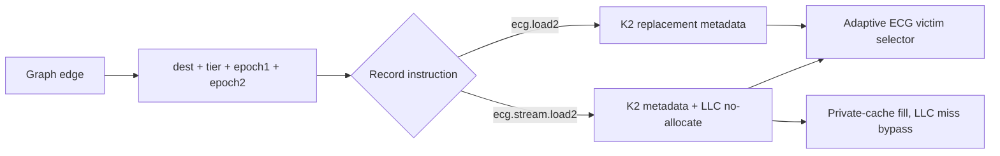

# ECG Cache Architecture Artifact

This branch is the implementation and reproducibility artifact for the successor
to **ECG: Expressing Locality and Prefetching for Optimal Caching in Graph
Structures** (IEEE IPDPSW 2024).

The new architecture adds:

- **K2** two-future-reference edge records;
- order-independent carried GRASP tiers;
- static and online set-dueling graph-cache replacement;
- **StreamShield** request-bound LLC placement control;
- RISC-V `ecg.load2` for PR/BFS/SSSP/BC/CC plus PR `ecg.stream.load2`;
- cache_sim, gem5, and Sniper implementations with exact equivalence gates.

The public HPCA paper name remains open. Implementation names remain `ECG_*`.

## Architecture at a glance


```mermaid
flowchart LR
    A[Graph edge] --> B[dest + tier + epoch1 + epoch2]
    B --> C{Record instruction}
    C -->|ecg.load2| D[K2 replacement metadata]
    C -->|ecg.stream.load2| E[K2 metadata + LLC no-allocate]
    D --> F[Adaptive ECG victim selector]
    E --> F
    E --> G[Private-cache fill, LLC miss bypass]
```

K2 uses one 64-bit record:

```text
| epoch2:15 | epoch1:15 | tier:2 | destination:32 |
```

For current epoch `c`, each candidate property line is assigned the nearer of
its two circular future-reference distances. The carried tier is computed from
direction-aware property-reader counts and uses the hottest vertex sharing the
line, so it does not require DBG physical ordering. PR uses epoch-first eviction,
BFS uses degree-first, and `ECG:K2_ONLINE` samples RRIP, GRASP, epoch, degree, and
LRU arms at runtime.
StreamShield preserves private-cache fills and LLC hits while suppressing only
LLC allocation after a record miss.

StreamShield is request-bound. Current gem5 K2 pair delivery uses the validated
in-order mailbox path; a request-bound pair extension is required before O3.

Full architecture diagrams and a worked example are in
[`research/ecg-hpca/ARCHITECTURE.md`](research/ecg-hpca/ARCHITECTURE.md).

## Policy comparison

| Policy | Guidance | Reserved LLC ways | LLC placement |
|---|---|---:|---|
| LRU | recency | 0 | normal |
| SRRIP | generic rereference interval | 0 | normal |
| GRASP | degree/address hotness | 0 | normal |
| P-OPT | live rereference matrix | charged | normal |
| ECG K2 | degree + RRIP + two edge-carried epochs | 0 | normal |
| ECG K2 online | five-arm set dueling | 0 | normal |
| ECG K2+StreamShield | K2 plus request-bound placement | 0 | no-allocate on record miss |

## Repository map

| Path | Purpose |
|---|---|
| `research/ecg-hpca/` | Paper SSOT, claim ledger, methodology, results, runbook |
| `research/ecg-hpca/evidence/` | Historical ECG experiments and audit evidence |
| `scripts/experiments/ecg/` | Canonical experiment, verification, analysis, and Slurm package |
| `bench/include/cache_sim/` | Functional cache hierarchy and ECG policy |
| `bench/include/gem5_sim/` | gem5 configs, overlays, and ISA support |
| `bench/include/sniper_sim/` | Sniper configs, overlays, and fused K2 model |
| `bench/src_sim/` | cache_sim-instrumented graph kernels |
| `bench/src_gem5/` | gem5 graph kernels |
| `bench/src_sniper/` | Sniper kernels and bounded SIFT workload |
| `wiki/ECG-HPCA-Paper.md` | Minimal public-facing status page |

## Setup

```bash
make setup-gem5
make setup-sniper
make all-sim
make gem5-riscv-m5ops-pr gem5-riscv-m5ops-bfs \
  gem5-riscv-m5ops-sssp gem5-riscv-m5ops-bc gem5-riscv-m5ops-cc
make sniper-sg_kernel
```

RISC-V gem5 builds additionally require a RISC-V cross compiler.

## Correctness gates

```bash
pytest -q scripts/test

python3 scripts/experiments/ecg/verify/equiv_kernels.py \
  --gem5 --sniper --kernels pr bfs sssp bc cc --schedule-k 2

python3 scripts/experiments/ecg/verify/equiv_kernels.py \
  --gem5 --sniper --kernels pr --schedule-k 2 --stream-bypass
```

## Paper matrix

Every reported comparison includes:

```text
LRU  SRRIP  GRASP  charged P-OPT
K2  K2-online  K2+StreamShield  K2-online+StreamShield
```

The cache_sim replacement baseline exposes uncharged and charged P-OPT,
`ECG:K1`, every static K2 arm, and `ECG:K2_ONLINE`. The hardware-faithful
factorial adds K1/K2 x StreamShield with record traffic charged.

The full-iteration Sniper profile is pending prefetch calibration. The current
generic STRIDE8 diagnostic increases LLC read traffic for every policy and must
not be used as a headline configuration.

```bash
python3 scripts/experiments/ecg/flows/paper_run.py \
  --profile streamshield_sniper_realgraph \
  --run-dir results/ecg_experiments/final_paper_runs/ecg_successor_webgoogle \
  --list --dry-run --no-build
```

See [`research/ecg-hpca/RUNBOOK.md`](research/ecg-hpca/RUNBOOK.md) for local,
Slurm, and aggregation workflows.

## Reproduction profiles

| Profile | Purpose |
|---|---|
| `ecg_smoke` | Fast cache_sim check including online K2 |
| `ecg_replacement_baseline` | Equal-capacity static-arm and online-regret study |
| `ecg_online_dueling` | Alias for the online-regret replacement stage |
| `ecg_cache_sim_factorial` | Real-graph K1/K2 x StreamShield attribution |
| `gem5_streamshield_mechanism` | RISC-V request-bound mechanism cell |
| `sniper_streamshield_mechanism` | Fused K2/StreamShield timing mechanism cell |
| `streamshield_sniper_realgraph` | Pending-calibration full-iteration web-Google matrix |

The completed cache_sim real-graph replacement profile finds that all five K2
arms are optimal somewhere; online K2 is within 0.26% geomean LLC misses of the
per-cell best static arm and beats it on 8/15 cells. Detailed-simulator
confirmation remains pending.

Relative to K1, the corrected tag-hit-preserving cache_sim factorial attributes
weighted avoided demand misses as **K2+online 83.94% / StreamShield 16.06%**.
StreamShield improves online K2, but full ECG still uses 5.28% more geomean
traffic than charged P-OPT.

## Prior-publication boundary

The IPDPSW 2024 ECG paper is archival. An HPCA submission must be materially
different, cite the workshop paper, disclose the contribution delta, and receive
PC-chair guidance before registration. See
[`research/ecg-hpca/CHAIR_QUERY.md`](research/ecg-hpca/CHAIR_QUERY.md).

Generated `results/`, simulator checkouts, binaries, traces, and graph files are
ignored and must not be committed.
