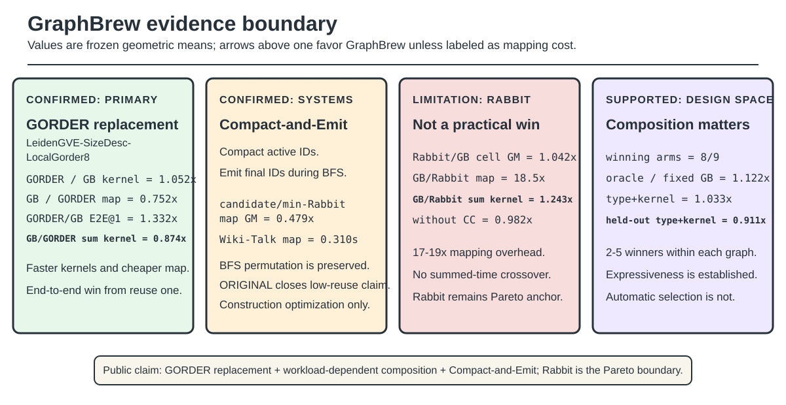

<p align="center"></p>

# GraphBrew

GraphBrew is a C++17/OpenMP framework for **composable and explainable vertex
layouts**. It separates three decisions that monolithic reorderers usually
couple:

| Decision | Purpose | Examples |
|---|---|---|
| Partitioner | discover vertex groups | GVE-Leiden, Rabbit |
| Block layout | place groups globally | identity, SizeDesc, supergraph order |
| Vertex layout | order vertices inside each block | BFS, RCM, local Gorder |


## Paper story

> **Vertex reordering is not one monolithic algorithm choice; it is a
> kernel-dependent layout-composition problem.**

GraphBrew represents a layout as `<P,B,L>`: partition vertices, place the
resulting blocks, and order vertices inside each block. It compiles that
expression into one persistent permutation and records requested/realized
semantics, mapping fingerprints, construction cost, executed work, and
amortized time.

The paper has three contributions:

1. **A compositional vertex-layout model and runtime.**

   For partition `P`, block permutation `B`, and local permutation `L`, the
   final ID is:

   ```text
   pi(v) = block_offset(B(P(v))) + L[P(v)](v)
   ```

   On 10 sealed graphs and five kernels, all seven evaluated compositions win
   cells. The oracle is **1.229x faster than the best fixed GraphBrew layout**
   and **1.116x faster than the fastest Rabbit/GORDER comparator**.

2. **Causal, kernel-specific mechanism evidence.**

   A fixed-membership `2 x 3` factorial holds Leiden communities constant and
   changes only `SizeDesc/DegreeDesc` and
   `HubSort/LocalGorder8/RCMpp`:

   | Kernel | Resolved effect | Explanation |
   |---|---:|---|
   | BFS | LocalGorder8 / HubSort = **1.143x** | Faster per examined edge; timing aligns with modeled hierarchy lookups |
   | CC | LocalGorder8 / HubSort = **1.248x** | HubSort performs 1.436x as many compression steps |
   | CC | LocalGorder8 / RCMpp = **1.514x** | LocalGorder8 performs only 0.405x as many compression steps |

   Block order has no universal main effect. PR favors HubSort by 1.332x, but
   its hardware mechanism remains unresolved.

3. **A practical layout and construction point.**

   `LeidenGVE-SizeDesc-LocalGorder8`

   ```text
   12:leiden:compose:sg_none:comm_size_desc:intra_gorder:gw8
   ```

   is **1.052x faster in kernel GM**, costs **0.752x** as much to map, and is
   **1.332x faster end to end at reuse 1** than `GORDER_csr`.

   Compact-and-Emit preserves a selected BFS permutation while removing
   sparse-community scheduling and final-emission work; its five-graph mapping
   cost is 0.479x the faster Rabbit implementation.

These results establish a useful composition space, not an automatic
selector. The frozen family-plus-kernel rule reaches only 0.896x versus the
fastest comparator. Rabbit remains the practical low-overhead Pareto boundary.



Machine-readable claim values and source hashes are in
[`docs/recommendation-evidence.json`](docs/recommendation-evidence.json).

## Build

```bash
python3 scripts/graphbrew_experiment.py --check-deps
make -j"$(nproc)" all
make check
```

The original `-o 8:boost` path requires Boost 1.58. The native
`-o 8:csr` implementation does not.

## Run

```bash
GRAPH=scripts/test/graphs/tiny/tiny.el

# Current-layout baseline
./bench/bin/pr -f "$GRAPH" -s -o 0 -n 3

# Rabbit baselines
./bench/bin/pr -f "$GRAPH" -s -o 8:csr -n 3
./bench/bin/pr -f "$GRAPH" -s -o 8:boost -n 3

# Confirmed fixed GraphBrew quality composition
./bench/bin/pr -f "$GRAPH" -s \
  -o '12:leiden:compose:sg_none:comm_size_desc:intra_gorder:gw8' \
  -n 3
```

`-o 12:<configuration>` always runs the exact composition supplied by the
user. GraphBrew does not search compositions at runtime.

## Reproduce experiments

Use the public orchestrator:

```bash
python3 scripts/graphbrew_experiment.py --vldb 2 --paper-preview \
  --paper-graph-dir /media/NVMeData/00_GraphDatasets/GraphBrew \
  --paper-artifact-root /media/NVMeData/00_GraphDatasets/GraphBrew/artifacts \
  --paper-threads 4 --paper-cpu-list 24-27
```

Final timing uses frozen protocols, pre-generated mappings, semantic
verification, fixed affinity, repeated trials, and fail-closed scheduler
checks. Large graphs and result artifacts belong on the external NVMe
partition, not in the repository.

## Repository map

```text
bench/src/                         graph kernels
bench/include/graphbrew/reorder/   reordering implementations
bench/include/external/gapbs/      graph builder and benchmark lifecycle
scripts/graphbrew_experiment.py    public experiment orchestrator
scripts/experiments/               frozen and restartable campaigns
scripts/test/                      regression and evidence checks
docs/                              public figures and evidence manifest
wiki/                              documentation source
```

## Documentation

- [Evidence and Claims](https://github.com/UVA-LavaLab/GraphBrew/wiki/Evidence-and-Claims)
- [GraphBrew Running Example](https://github.com/UVA-LavaLab/GraphBrew/wiki/GraphBrew-Running-Example)
- [GraphBrewOrder](https://github.com/UVA-LavaLab/GraphBrew/wiki/GraphBrewOrder)
- [Reordering Algorithms](https://github.com/UVA-LavaLab/GraphBrew/wiki/Reordering-Algorithms)
- [Reproducible Experiments](https://github.com/UVA-LavaLab/GraphBrew/wiki/Reproducible-Experiments)
- [Command-Line Reference](https://github.com/UVA-LavaLab/GraphBrew/wiki/Command-Line-Reference)

## Attribution and license

GraphBrew includes or compares against GAPBS, Rabbit Order, Gorder,
GVE-Leiden, RCM, Corder, and related locality methods. Attributions are
recorded in source headers and the wiki.

See [LICENSE](LICENSE).
