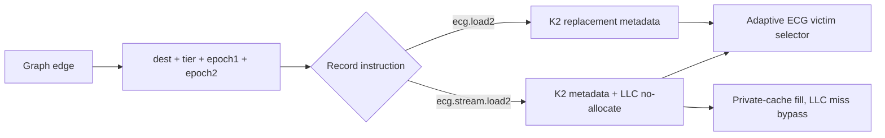

# ECG Cache Architecture Artifact

This branch is the implementation and reproducibility artifact for the successor
to **ECG: Expressing Locality and Prefetching for Optimal Caching in Graph
Structures** (IEEE IPDPSW 2024).

The new architecture adds:

- **K2** two-future-reference edge records;
- order-independent carried GRASP tiers;
- static and online set-dueling graph-cache replacement;
- **StreamShield** request-bound LLC placement control;
- RISC-V `ecg.load2` and `ecg.stream.load2` for PR/BFS/SSSP/BC/CC;
- cache_sim, gem5, and Sniper implementations with exact equivalence gates.

The public HPCA paper name remains open. Implementation names remain `ECG_*`.

## Architecture at a glance


```mermaid
flowchart LR
    A[Graph edge] --> B[dest + tier + epoch1 + epoch2]
    B --> C{Record instruction}
    C -->|ecg.load2| D[K2 replacement metadata]
    C -->|ecg.stream.load2| E[K2 metadata + LLC no-allocate]
    D --> F[Adaptive ECG victim selector]
    E --> F
    E --> G[Private-cache fill, LLC miss bypass]
```

K2 uses one 64-bit record:

```text
| epoch2:15 | epoch1:15 | tier:2 | destination:32 |
```

For current epoch `c`, each candidate property line is assigned the nearer of
its two circular future-reference distances. The carried tier is computed from
direction-aware property-reader counts and uses the hottest vertex sharing the
line, so it does not require DBG physical ordering. PR uses epoch-first eviction,
BFS uses degree-first, and `ECG:K2_ONLINE` samples RRIP, GRASP, epoch, degree, and
LRU arms at runtime.
StreamShield preserves private-cache fills and LLC hits while suppressing only
LLC allocation after a record miss.

StreamShield is request-bound. Current gem5 K2 pair delivery uses the validated
in-order mailbox path; a request-bound pair extension is required before O3.

Full architecture diagrams and a worked example are in
[`research/ecg-hpca/ARCHITECTURE.md`](research/ecg-hpca/ARCHITECTURE.md).

## Final design

The selected design is:

```text
ECG:K2_ONLINE_STREAMSHIELD
= tiered K2 + five-arm online replacement + static generic StreamShield
```

Static StreamShield beats normal LLC allocation on all 15 tested graph/kernel
cells. `ECG:K2_ONLINE_ADAPTIVE_STREAMSHIELD` remains a default-off ablation.

## Policy comparison

| Policy | Guidance | Reserved LLC ways | LLC placement |
|---|---|---:|---|
| LRU | recency | 0 | normal |
| SRRIP | generic rereference interval | 0 | normal |
| GRASP | degree/address hotness | 0 | normal |
| P-OPT | live rereference matrix | charged | normal |
| ECG K2 | degree + RRIP + two edge-carried epochs | 0 | normal |
| ECG K2 online | five-arm set dueling | 0 | normal |
| ECG K2+StreamShield | K2 plus request-bound placement | 0 | no-allocate on record miss |

## Repository map

| Path | Purpose |
|---|---|
| `research/ecg-hpca/` | Paper SSOT, claim ledger, methodology, results, runbook |
| `research/ecg-hpca/evidence/` | Historical ECG experiments and audit evidence |
| `scripts/experiments/ecg/` | Canonical experiment, verification, analysis, and Slurm package |
| `bench/include/cache_sim/` | Functional cache hierarchy and ECG policy |
| `bench/include/gem5_sim/` | gem5 configs, overlays, and ISA support |
| `bench/include/sniper_sim/` | Sniper configs, overlays, and fused K2 model |
| `bench/src_sim/` | cache_sim-instrumented graph kernels |
| `bench/src_gem5/` | gem5 graph kernels |
| `bench/src_sniper/` | Sniper kernels and bounded SIFT workload |
| `wiki/ECG-HPCA-Paper.md` | Minimal public-facing status page |

## Reproduce

### 1. Setup and build

```bash
make setup-gem5
make setup-sniper
make all-sim
make gem5-riscv-m5ops-pr gem5-riscv-m5ops-bfs \
  gem5-riscv-m5ops-sssp gem5-riscv-m5ops-bc gem5-riscv-m5ops-cc
make sniper-sg_kernel
```

RISC-V gem5 builds additionally require a RISC-V cross compiler.

Graph paths and dataset staging commands are in
[`research/ecg-hpca/RUNBOOK.md`](research/ecg-hpca/RUNBOOK.md).

### 2. Check graphs and inspect jobs

```bash
python3 scripts/experiments/ecg/flows/paper_run.py \
  --profile ecg_replacement_baseline \
  --run-dir /tmp/ecg-check \
  --check-graphs --no-build

python3 scripts/experiments/ecg/flows/paper_run.py \
  --profile ecg_cache_sim_factorial \
  --run-dir /tmp/ecg-factorial-dry \
  --list --dry-run --no-build
```

Use a new run directory for filtered or simulator-only shards.

### 3. Run correctness gates

```bash
pytest -q scripts/test

python3 scripts/experiments/ecg/verify/equiv_kernels.py \
  --gem5 --sniper --kernels pr bfs sssp bc cc --schedule-k 2

python3 scripts/experiments/ecg/verify/equiv_kernels.py \
  --gem5 --sniper --kernels pr bfs sssp bc cc \
  --schedule-k 2 --stream-bypass
```

### 4. Run the full 3-simulator smoke

```bash
python3 scripts/experiments/ecg/slurm/make_slurm_shards.py \
  --profile ecg_3sim_allalg_smoke \
  --run-tag ecg_3sim_smoke \
  --out results/ecg_experiments/slurm/ecg_3sim_smoke.tsv

python3 scripts/experiments/ecg/flows/run_local_shards.py \
  --shards results/ecg_experiments/slurm/ecg_3sim_smoke.tsv \
  --run-root results/ecg_experiments/final_paper_runs/local \
  --jobs 8 --cache-sim-jobs 5 --gem5-jobs 1 --sniper-jobs 1

python3 scripts/experiments/ecg/flows/paper_pipeline.py \
  --skip-run \
  --input-run-glob \
    "results/ecg_experiments/final_paper_runs/local/ecg_3sim_smoke/*" \
  --run-root results/ecg_experiments/paper_pipeline/ecg_3sim_smoke

python3 scripts/experiments/ecg/verify/smoke_coverage.py \
  --csv results/ecg_experiments/paper_pipeline/ecg_3sim_smoke/aggregate/roi_matrix_all.csv
```

The gate requires exactly 120 valid rows.

### 5. Run the three-real-graph cross-simulator matrix

```bash
python3 scripts/experiments/ecg/slurm/make_slurm_shards.py \
  --profile ecg_3sim_realgraph_allalg \
  --run-tag ecg_3sim_realgraph_allalg \
  --out results/ecg_experiments/slurm/ecg_3sim_realgraph_allalg.tsv

python3 scripts/experiments/ecg/flows/run_local_shards.py \
  --shards results/ecg_experiments/slurm/ecg_3sim_realgraph_allalg.tsv \
  --run-root results/ecg_experiments/final_paper_runs/local \
  --jobs 9 --cache-sim-jobs 4 --gem5-jobs 4 --sniper-jobs 1
```

This expands to 360 rows: 3 simulators x 3 graphs x 5 algorithms x 8
policies. Run one Sniper LRU/PR calibration for each graph before the full
launch. Gem5 sidebands are isolated per shard; four concurrent jobs are the
conservative single-node default for a 32-core/62-GiB host. Compare
`roi_relative_metrics.csv` within each simulator; absolute miss rates are not
cross-simulator metrics.

For quick diagnostic results, use `ecg_3sim_realgraph_allalg_1b`. Cache_sim
still runs to completion; gem5 and Sniper stop after one billion committed
detailed-ROI instructions. These capped rows are cache diagnostics, not
speedup or equal-work results.

```bash
python3 scripts/experiments/ecg/slurm/make_slurm_shards.py \
  --profile ecg_3sim_realgraph_allalg_1b \
  --run-tag ecg_3sim_realgraph_allalg_1b \
  --out results/ecg_experiments/slurm/ecg_3sim_realgraph_allalg_1b.tsv
```

For the fast full-work comparison, use `ecg_3sim_sampled_allalg`. It runs
deterministic samples of web-Google, soc-pokec, and cit-Patents to completion
in all three simulators while retaining the five algorithms and eight policies.

```bash
python3 scripts/experiments/ecg/slurm/make_slurm_shards.py \
  --profile ecg_3sim_sampled_allalg \
  --run-tag ecg_3sim_sampled_allalg \
  --out results/ecg_experiments/slurm/ecg_3sim_sampled_allalg.tsv
```

For equal-work Sniper timing of the fused record stream on sampled PageRank,
use `ecg_sniper_sampled_pr_streamengine`. It compares GRASP, capacity-charged
P-OPT, and K2-online+StreamShield while retaining K2 record misses in LLC
accounting.

```bash
python3 scripts/experiments/ecg/slurm/make_slurm_shards.py \
  --profile ecg_sniper_sampled_pr_streamengine \
  --run-tag ecg_sniper_sampled_pr_streamengine \
  --out results/ecg_experiments/slurm/ecg_sniper_sampled_pr_streamengine.tsv
```

First prove warm full-graph entry with the 100K-ROI gate:

```bash
python3 scripts/experiments/ecg/slurm/make_slurm_shards.py \
  --profile ecg_sniper_realgraph_warm_probe \
  --run-tag ecg_sniper_realgraph_warm_probe \
  --out results/ecg_experiments/slurm/ecg_sniper_realgraph_warm_probe.tsv
```

The paper-faithful full-graph detailed profile is
`ecg_sniper_realgraph_600m`: explicit SIFT execution with graph loading outside
the detailed ROI and a 600-million-instruction cap, matching DROPLET's
bounded methodology. CACHE_ONLY warmup updates cache state without accumulating
queue/shared-memory timing. Because K2 executes a different instruction stream,
capped rows are cache/direction diagnostics, not speedup claims.

```bash
python3 scripts/experiments/ecg/slurm/make_slurm_shards.py \
  --profile ecg_sniper_realgraph_600m \
  --run-tag ecg_sniper_realgraph_600m \
  --out results/ecg_experiments/slurm/ecg_sniper_realgraph_600m.tsv
```

### 6. Run cache_sim authority profiles

```bash
python3 scripts/experiments/ecg/flows/paper_run.py \
  --profile ecg_replacement_baseline \
  --run-dir results/ecg_experiments/final_paper_runs/ecg_replacement \
  --no-build

python3 scripts/experiments/ecg/flows/paper_run.py \
  --profile ecg_cache_sim_factorial \
  --run-dir results/ecg_experiments/final_paper_runs/ecg_factorial \
  --no-build

python3 scripts/experiments/ecg/flows/paper_run.py \
  --profile ecg_streamshield_generality \
  --run-dir results/ecg_experiments/final_paper_runs/ecg_streamshield_generality \
  --no-build
```

### 7. Run detailed-simulator mechanism cells

```bash
python3 scripts/experiments/ecg/flows/paper_run.py \
  --profile gem5_streamshield_mechanism \
  --run-dir results/ecg_experiments/final_paper_runs/gem5_mechanism \
  --no-build

python3 scripts/experiments/ecg/flows/paper_run.py \
  --profile sniper_streamshield_mechanism \
  --run-dir results/ecg_experiments/final_paper_runs/sniper_mechanism \
  --no-build
```

### 8. Aggregate

```bash
python3 scripts/experiments/ecg/flows/paper_pipeline.py \
  --skip-run \
  --input-run-dirs \
    results/ecg_experiments/final_paper_runs/ecg_replacement \
    results/ecg_experiments/final_paper_runs/ecg_factorial \
    results/ecg_experiments/final_paper_runs/ecg_streamshield_generality \
  --run-root results/ecg_experiments/paper_pipeline/ecg_final
```

### 9. Run other independent shards in parallel

Prebuild first; shards never build or share output directories.

```bash
python3 scripts/experiments/ecg/slurm/make_slurm_shards.py \
  --profile ecg_streamshield_generality \
  --run-tag ecg_generality_parallel \
  --out results/ecg_experiments/slurm/ecg_generality_parallel.tsv

python3 scripts/experiments/ecg/flows/run_local_shards.py \
  --shards results/ecg_experiments/slurm/ecg_generality_parallel.tsv \
  --run-root results/ecg_experiments/final_paper_runs/local \
  --jobs 8 --cache-sim-jobs 8 --gem5-jobs 1 --sniper-jobs 1

python3 scripts/experiments/ecg/flows/paper_pipeline.py \
  --skip-run \
  --input-run-glob \
    "results/ecg_experiments/final_paper_runs/local/ecg_generality_parallel/*" \
  --run-root results/ecg_experiments/paper_pipeline/ecg_generality_parallel
```

Each shard has a unique run directory, lock, and hashed gem5/Sniper sideband
directory. Increase `--gem5-jobs` or `--sniper-jobs` only when host memory and
CPU capacity are known.

### 10. Headline matrix status

`streamshield_sniper_realgraph` is blocked until a bounded Sniper prefetch
configuration replaces the rejected generic STRIDE8 setting. Inspect it only:

```bash
python3 scripts/experiments/ecg/flows/paper_run.py \
  --profile streamshield_sniper_realgraph \
  --run-dir /tmp/ecg-headline-dry \
  --list --dry-run --no-build
```

## Reported policy set

Every reported comparison includes:

```text
LRU  SRRIP  GRASP  charged P-OPT
K2  K2-online  K2+StreamShield  K2-online+StreamShield
```

The cache_sim replacement baseline exposes uncharged and charged P-OPT,
`ECG:K1`, every static K2 arm, and `ECG:K2_ONLINE`. The hardware-faithful
factorial adds K1/K2 x StreamShield with record traffic charged.

## Reproduction profiles

| Profile | Purpose |
|---|---|
| `ecg_smoke` | Fast cache_sim check including online K2 |
| `ecg_3sim_allalg_smoke` | 120-row final data-shape smoke |
| `ecg_3sim_realgraph_allalg` | 360-row three-simulator real-graph comparison |
| `ecg_3sim_realgraph_allalg_1b` | Full cache_sim plus 1B-instruction gem5/Sniper diagnostic |
| `ecg_3sim_sampled_allalg` | Full-work 3-simulator matrix on deterministic real-graph samples |
| `ecg_sniper_sampled_pr_streamengine` | Equal-work sampled PR timing for fused K2 bandwidth |
| `ecg_sniper_realgraph_warm_probe` | Full web-Google warm-SIFT LRU/K2 100K gate |
| `ecg_sniper_realgraph_600m` | Full-real-graph Sniper 600M-capped ROI plan |
| `ecg_replacement_baseline` | Equal-capacity static-arm and online-regret study |
| `ecg_online_dueling` | Alias for the online-regret replacement stage |
| `ecg_cache_sim_factorial` | Real-graph K1/K2 x StreamShield attribution |
| `ecg_streamshield_generality` | All-kernel allocate-vs-shield comparison |
| `gem5_streamshield_mechanism` | RISC-V request-bound mechanism cell |
| `sniper_streamshield_mechanism` | Fused K2/StreamShield timing mechanism cell |
| `streamshield_sniper_realgraph` | Pending-calibration full-iteration web-Google matrix |

The completed cache_sim real-graph replacement profile finds that all five K2
arms are optimal somewhere; online K2 is within 0.26% geomean LLC misses of the
per-cell best static arm and beats it on 8/15 cells. Detailed-simulator
confirmation remains pending.

Relative to K1, the corrected tag-hit-preserving cache_sim factorial attributes
weighted avoided demand misses as **K2+online 83.94% / StreamShield 16.06%**.
StreamShield improves online K2, but full ECG still uses 5.28% more geomean
traffic than charged P-OPT.

Adaptive placement recovers 4.28% geomean misses versus always allocating K2
records on PR, but the all-kernel matrix finds static StreamShield better on
15/15 cells. Adaptive placement remains a default-off ablation.

## Prior-publication boundary

The IPDPSW 2024 ECG paper is archival. An HPCA submission must be materially
different, cite the workshop paper, disclose the contribution delta, and receive
PC-chair guidance before registration. See
[`research/ecg-hpca/CHAIR_QUERY.md`](research/ecg-hpca/CHAIR_QUERY.md).

Generated `results/`, simulator checkouts, binaries, traces, and graph files are
ignored and must not be committed.
