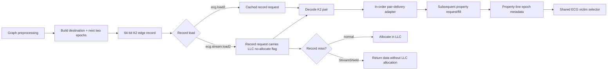
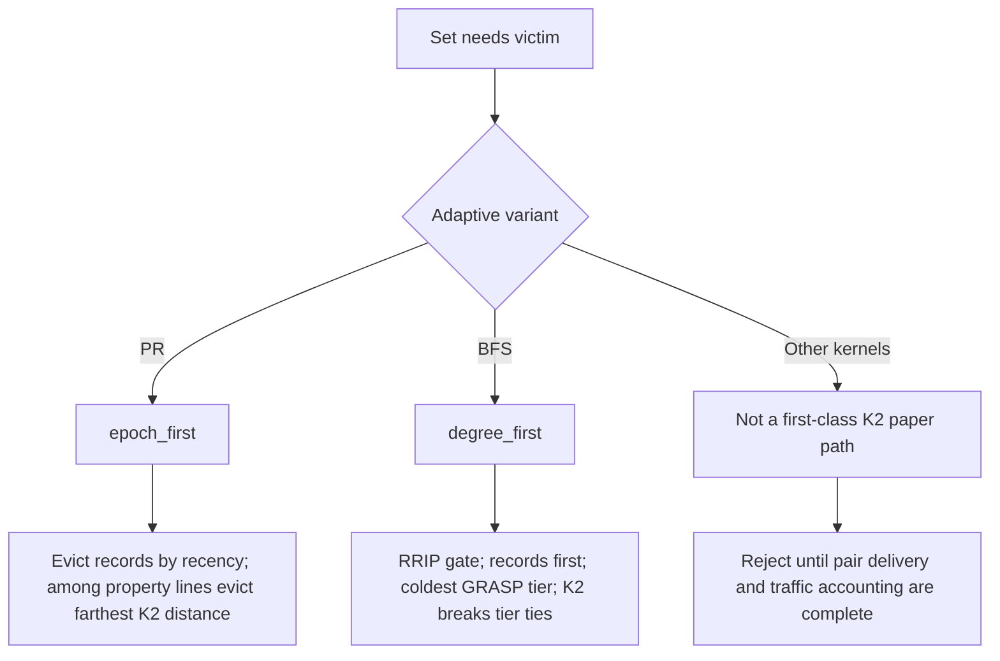
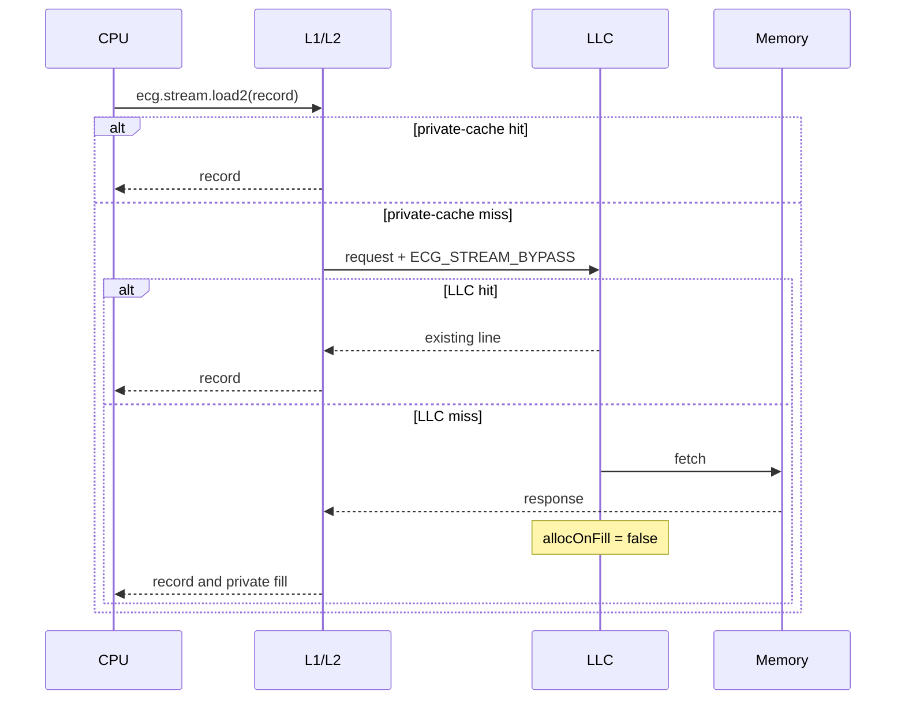
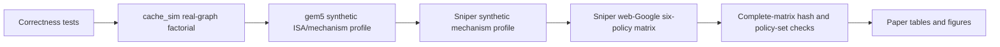

# ECG Successor Architecture

## Objective

The architecture carries graph reuse information in the edge record that the
kernel already streams. The same in-band information controls:

1. **replacement** — which property line should leave the LLC; and
2. **placement** — whether a one-touch record should allocate in the LLC.

The design targets three invariants:

- zero ECG-reserved LLC ways;
- no hidden live rereference matrix;
- request-bound StreamShield placement.

Current gem5 K2 pair delivery is validated only on the in-order CPU: the record
load deposits the pair in a serialized mailbox and the subsequent property fill
consumes it. A request-bound K2 pair extension is required before O3 is enabled.

## K2 record

The canonical Schedule-2 record is 64 bits:

```text
63                    48 47                    32 31                     0
+-----------------------+-----------------------+------------------------+
|   epoch2 (16 bits)    |   epoch1 (16 bits)    |    destination (32)    |
+-----------------------+-----------------------+------------------------+
```

`epoch1` and `epoch2` are the next two quantized rereference epochs for the
governed property line. They are constructed before the ROI and streamed with
the edge.

For `N_e` circular epochs and current epoch `c`, the distance to delivered epoch
`e` is:

```text
d(e, c) = (e + N_e - (c mod N_e)) mod N_e
```

K2 uses the nearer valid future reference:

```text
d_K2 = min(d(epoch1, c), d(epoch2, c))
```

The shared implementation is `ecg_policy::epochPairDistance`.

## End-to-end data flow



The property access and record access remain ordinary memory requests.
StreamShield rides its record request; current gem5 K2 epochs are serialized
between the record load and the following property access.

## Replacement policy

All simulators call the same victim selector in
`bench/include/ecg_victim_policy.h`.



### Insertion

ECG uses the paper-faithful GRASP insertion tiers:

| Class | Initial 3-bit RRPV |
|---|---:|
| high reuse / hot | 1 |
| moderate reuse | 6 |
| cold, record, or non-property | 7 |

### Eviction

K2 does not replace RRIP or degree information universally. It supplies the
future-reuse ordering appropriate to each kernel:

- PR's monotonic iterative sweep benefits from epoch-first ordering.
- BFS frontier order is data-dependent, so degree is the stable first signal
  and K2 is a tie-break.
- SSSP/BC/CC research variants remain in the evidence archive, but the current
  runner rejects first-class K2 labels for those kernels.

## StreamShield placement

StreamShield identifies packed record requests that should remain useful in the
private hierarchy but should not pollute the shared LLC.



StreamShield therefore preserves:

- L1/L2 fills;
- LLC tag lookup and LLC hits;
- normal memory ordering.

It suppresses only the returning LLC miss insertion. Derived gem5 stride
prefetches inherit the same request flag.

## ISA

The fused PR path uses RISC-V custom-0 I-type encodings:

| Instruction | FUNCT3 | Effect |
|---|---:|---|
| `ecg.load2 rd, 0(rs1)` | `0x4` | PR: load full K2 record and deliver both epochs |
| `ecg.stream.load2 rd, 0(rs1)` | `0x3` | PR: same, plus request-bound LLC no-allocation |

The complete packed record is returned in `rd`; no extra register repacking or
per-edge SimMagic instruction is required. StreamShield is request-bound. K2
pair delivery remains in-order-only until its request extension is implemented.

The current gem5 BFS equivalence path performs a normal packed 8-byte record
load followed by `ecg.extract2`. It validates K2 construction, delivery, and
victim decisions, but is not used for fused-load timing claims.

## Worked K2 example

Assume `N_e = 256` and current epoch `c = 10`.

| Resident property line | K2 epochs | Effective distance |
|---|---|---:|
| A | `(12, 40)` | `min(2, 30) = 2` |
| B | `(20, 30)` | `min(10, 20) = 10` |
| C | `(11, 13)` | `min(1, 3) = 1` |

If these lines are otherwise tied, epoch-first eviction selects **B** because
its next use is farthest away. A record line is handled by the record-first
placement/recency rule rather than pretending its epoch is meaningful.

## Comparison with prior policies

| Policy | Main signal | Extra structure | Reserved LLC capacity | Placement control |
|---|---|---|---:|---|
| LRU | recency | none | 0 | no |
| SRRIP | predicted interval from generic insertion/aging | per-line RRPV | 0 | no |
| GRASP | degree/address hotness + RRIP | reordered hot/moderate regions | 0 | no |
| P-OPT | live next-reference distance | rereference matrix | charged ways | no |
| ECG K2 | degree + RRIP + two edge-carried future epochs | 8-byte edge record | 0 | no |
| ECG K2+StreamShield | same as K2 | 8-byte edge record + request bit | 0 | LLC no-allocate |

The paper comparison always reports all six policies side-by-side.

## Simulator realization

| Surface | cache_sim | gem5 | Sniper |
|---|---|---|---|
| K2 construction | shared builder | shared builder | shared builder |
| K2 distance | shared selector | shared selector | shared selector |
| Delivery | instrumented edge load | PR: fused load2; BFS: packed load + `ecg.extract2`; serialized in-order pair mailbox | fused record sideband model |
| StreamShield | preserve LLC hits, suppress miss insertion | request flag clears LLC `allocOnFill` | preserve NUCA hit path, suppress miss insertion |
| Purpose | functional authority | cycle-accurate ISA confirmation | scale/timing confirmation |

## Hardware cost model

- K2 record: 8 bytes per edge record.
- ECG-reserved LLC ways: 0.
- StreamShield state: one request flag propagated through the hierarchy.
- Per-line ECG metadata: two 16-bit epochs, valid/count state, and existing
  RRIP/degree metadata.
- gem5 O3 requires the planned request-bound K2 pair extension.
- P-OPT comparison: charged for its active rereference-matrix capacity.

The artifact rejects hidden matrices, zero-latency bypass, and aggressive
per-access LLC metadata broadcasts in headline rows.

## Evaluation flow



The final claim is frozen only after every required policy completes with the
same graph, cache geometry, prefetch degree, ROI, binary fingerprints, and
configuration hash.
