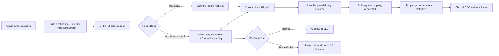
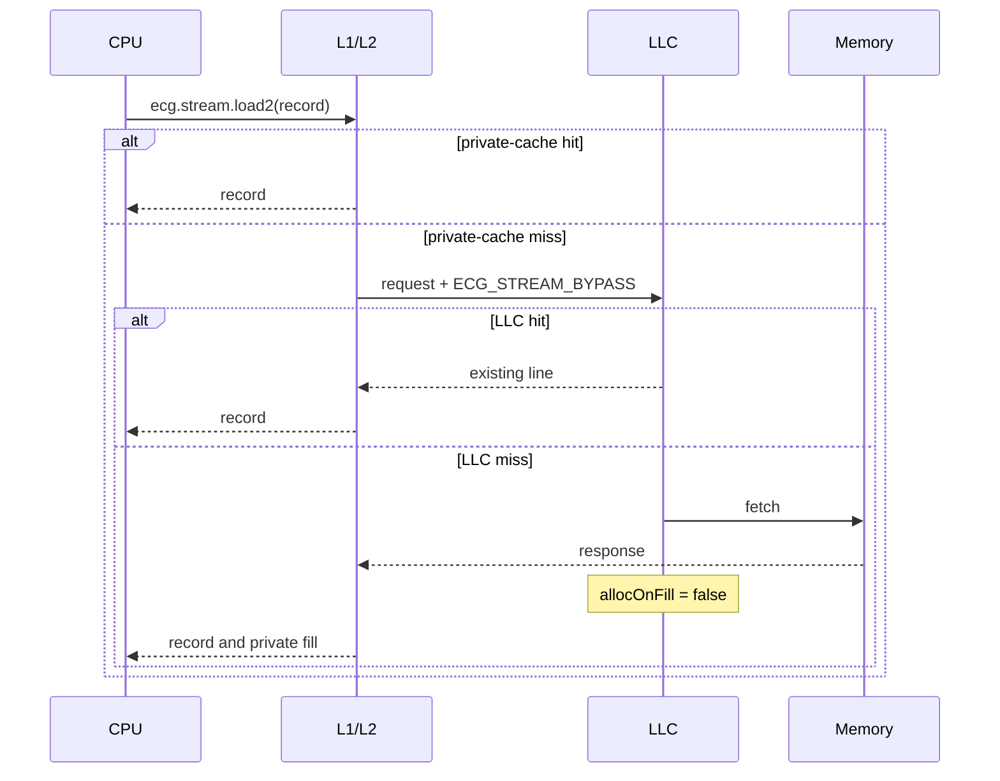

# ECG Successor Architecture

## Objective

The architecture carries graph reuse information in the edge record that the
kernel already streams. The same in-band information controls:

1. **replacement** — which property line should leave the LLC; and
2. **placement** — whether a one-touch record should allocate in the LLC.

The design targets four invariants:

- zero ECG-reserved LLC ways;
- no hidden live rereference matrix;
- order-independent degree guidance carried with the edge;
- request-bound StreamShield placement.

Current gem5 K2 pair delivery is validated only on the in-order CPU: the record
load deposits the pair in a serialized mailbox and the subsequent property fill
consumes it. A request-bound K2 pair extension is required before O3 is enabled.

## K2 record

The canonical Schedule-2 record is 64 bits:

```text
63                 49 48                 34 33   32 31                  0
+---------------------+---------------------+-------+---------------------+
| epoch2 (15 bits)    | epoch1 (15 bits)    | tier  | destination (32)    |
+---------------------+---------------------+-------+---------------------+
```

`epoch1` and `epoch2` are the next two quantized rereference epochs for the
governed property line. They are constructed before the ROI and streamed with
the edge. `tier` is `1/2/3` for hot/moderate/cold; zero is invalid.
Fused sideband indexing drops zero-tier records, so an invalid hint never
stamps LLC replacement metadata.

The preprocessing pass counts property readers in the kernel's traversal
direction, ranks vertices by that reuse count, assigns the top 15% hot and next
15% moderate by default, and stores the **hottest tier among all vertices
sharing the property cache line**. The tier therefore remains meaningful
without DBG physical ordering. K2 supports at most `N_e = 32768` circular
epochs so the complete record remains exactly eight bytes.

For `N_e` circular epochs and current epoch `c`, the distance to delivered epoch
`e` is:

```text
d(e, c) = (e + N_e - (c mod N_e)) mod N_e
```

K2 uses the nearer valid future reference:

```text
d_K2 = min(d(epoch1, c), d(epoch2, c))
```

The shared implementation is `ecg_policy::epochPairDistance`.

## End-to-end data flow


```mermaid
flowchart LR
    A[Graph preprocessing] --> B[Build destination + line tier + next two epochs]
    B --> C[64-bit K2 edge record]
    C --> D{Record load}
    D -->|ecg.load2| E[Cached record request]
    D -->|ecg.stream.load2| F[Record request carries LLC no-allocate flag]
    E --> G[Decode tier + K2 pair]
    F --> G
    G --> H[In-order pair-delivery adapter]
    H --> I[Subsequent property request/fill]
    I --> J[Property-line tier + epoch metadata]
    J --> K[Shared ECG victim selector]
    F --> L{Record miss?}
    L -->|normal| M[Allocate in LLC]
    L -->|StreamShield| N[Return data without LLC allocation]
```

The property access and record access remain ordinary memory requests.
StreamShield rides its record request; current gem5 K2 epochs are serialized
between the record load and the following property access.

## Replacement policy

All simulators call the same victim selector in
`bench/include/ecg_victim_policy.h`.

Static paper arms remain explicit: PR uses `epoch_first`, while BFS uses
`degree_first`. The carried tier removes their dependency on DBG layout.

### Insertion

ECG uses the paper-faithful GRASP insertion tiers:

| Class | Initial 3-bit RRPV |
|---|---:|
| high reuse / hot | 1 |
| moderate reuse | 6 |
| cold, record, or non-property | 7 |

### Eviction

K2 does not replace RRIP or degree information universally. It supplies the
future-reuse ordering appropriate to each kernel:

- PR's monotonic iterative sweep benefits from epoch-first ordering.
- BFS and SSSP frontier order is data-dependent, so degree is the stable first
  signal and K2 is a tie-break.
- BC and CC use `rrip_first`: their backward or pointer-chasing phases are not
  a monotonic edge sweep, so K2 refines only the delivered forward-edge reads.
- BC K2 delivery covers the forward Brandes BFS. Its runtime successor-DAG
  backward phase has no stable static edge-record position and intentionally
  remains ordinary RRIP/recency behavior.
- CC K2 delivery follows its OUT-edge records and is certified only for the
  algorithm's existing undirected/symmetric-graph contract.

### Online set dueling

`ECG:K2_ONLINE` removes the pre-run kernel-to-policy choice. Five of every 64
LLC sets are fixed leader sets:

| Leader arm | Victim rule |
|---|---|
| `rrip_first` | RRIP gate, records first, then K2 |
| `grasp_only` | GRASP insertion with pure RRIP eviction |
| `epoch_first` | records first, then farthest K2 |
| `degree_first` | RRIP gate, coldest carried tier, then K2 |
| `lru_only` | oldest line |

Follower sets use the arm with the fewest sampled leader misses. Counts reset
every 1024 leader misses so the choice can follow phase changes. The selector is
graph- and kernel-name agnostic and is live in cache_sim, gem5, and Sniper.
Tiered K2 construction, delivery, and victim checks are first-class for
PR/BFS/SSSP/BC/CC in cache_sim, gem5, and Sniper.

### Adaptive StreamShield placement

`ECG:K2_ONLINE_ADAPTIVE_STREAMSHIELD` adds a separate two-arm placement duel:

- set slot 5 always allocates eligible K2 records in the LLC;
- set slot 6 always applies StreamShield;
- the other 62/64 sets follow the current placement winner.

Both leaders count total LLC misses, including property pollution and record
reuse effects. Every 1024 sampled leader misses, the lower-miss placement wins;
ties and startup choose allocation as the safe default. This selector is
independent of the five-arm property victim selector.

## StreamShield placement

StreamShield identifies packed record requests that should remain useful in the
private hierarchy but should not pollute the shared LLC.


```mermaid
sequenceDiagram
    participant CPU
    participant L1L2 as L1/L2
    participant LLC
    participant MEM as Memory
    CPU->>L1L2: ecg.stream.load2(record)
    alt private-cache hit
        L1L2-->>CPU: record
    else private-cache miss
        L1L2->>LLC: request + ECG_STREAM_BYPASS
        alt LLC hit
            LLC-->>L1L2: existing line
            L1L2-->>CPU: record
        else LLC miss
            LLC->>MEM: fetch
            MEM-->>L1L2: response
            Note over LLC: allocOnFill = false
            L1L2-->>CPU: record and private fill
        end
    end
```

StreamShield therefore preserves:

- L1/L2 fills;
- LLC tag lookup and LLC hits;
- normal memory ordering.

It suppresses only the returning LLC miss insertion. Derived gem5 stride
prefetches inherit the same request flag.

## ISA

The fused Schedule-2 path uses RISC-V custom-0 I-type encodings:

| Instruction | FUNCT3 | Effect |
|---|---:|---|
| `ecg.load2 rd, 0(rs1)` | `0x4` | PR/BFS/SSSP/BC/CC: load the K2 record and deliver tier plus both epochs |
| `ecg.stream.load2 rd, 0(rs1)` | `0x3` | PR/BFS/SSSP/BC/CC: same, plus request-bound LLC no-allocation |

The complete packed record is returned in `rd`; no extra register repacking or
per-edge SimMagic instruction is required. StreamShield is request-bound. K2
pair delivery remains in-order-only until its request extension is implemented.

All five gem5 kernels execute `ecg.load2`; all five Sniper kernels use the
equivalent fused record sideband model without per-edge SimMagic. The full
15-cell gate requires exact K2 delivery and victim compliance in cache_sim,
gem5, and Sniper. gem5 remains in-order-only until the pair is attached to the
specific O3 request.

## Worked K2 example

Assume `N_e = 256` and current epoch `c = 10`.

| Resident property line | K2 epochs | Effective distance |
|---|---|---:|
| A | `(12, 40)` | `min(2, 30) = 2` |
| B | `(20, 30)` | `min(10, 20) = 10` |
| C | `(11, 13)` | `min(1, 3) = 1` |

If these lines are otherwise tied, epoch-first eviction selects **B** because
its next use is farthest away. A record line is handled by the record-first
placement/recency rule rather than pretending its epoch is meaningful.

## Comparison with prior policies

| Policy | Main signal | Extra structure | Reserved LLC capacity | Placement control |
|---|---|---|---:|---|
| LRU | recency | none | 0 | no |
| SRRIP | predicted interval from generic insertion/aging | per-line RRPV | 0 | no |
| GRASP | degree/address hotness + RRIP | reordered hot/moderate regions | 0 | no |
| P-OPT | live next-reference distance | rereference matrix | charged ways | no |
| ECG K2 | carried line tier + RRIP + two future epochs | 8-byte edge record | 0 | no |
| ECG K2 online | sampled best of five victim rules | same record + counters | 0 | no |
| ECG K2+StreamShield | same as K2 | 8-byte edge record + request bit | 0 | LLC no-allocate |

The headline comparison reports all four baselines plus static/online K2 with
and without StreamShield.

## Simulator realization

| Surface | cache_sim | gem5 | Sniper |
|---|---|---|---|
| K2 construction | shared builder | shared builder | shared builder |
| K2 distance | shared selector | shared selector | shared selector |
| Tier delivery | instrumented record | fused `ecg.load2` | fused record sideband |
| Online selection | exact set index | gem5 replaceable-entry set | Sniper cache-set index |
| Epoch delivery | instrumented edge load | all five: fused `ecg.load2`; serialized in-order pair mailbox | all five: fused record sideband model |
| StreamShield | preserve LLC hits, suppress miss insertion | request flag clears LLC `allocOnFill` | preserve NUCA hit path, suppress miss insertion |
| Address stability | aligned properties + fixed indexed record streams | aligned properties/records | aligned properties/records |
| Purpose | functional authority | cycle-accurate ISA confirmation | scale/timing confirmation |

## Hardware cost model

- K2 record: 8 bytes per edge record.
- ECG-reserved LLC ways: 0.
- StreamShield state: one request flag propagated through the hierarchy.
- Per-line ECG metadata: two 15-bit epochs, 2-bit carried tier, valid/count
  state, and existing RRPV/recency state.
- Online selector: five sampled leader classes plus small miss counters; no
  per-line selector state.
- Adaptive StreamShield: two disjoint placement leaders, two miss counters, and
  one winner bit; no per-line state.
- gem5 O3 requires the planned request-bound K2 pair extension.
- P-OPT comparison: charged for its active rereference-matrix capacity.

The artifact rejects hidden matrices, zero-latency bypass, and aggressive
per-access LLC metadata broadcasts in headline rows.

## Evaluation flow


```mermaid
flowchart LR
    A[Correctness tests] --> B[Equal-capacity static-arm and online-regret baseline]
    B --> C[Hardware-faithful K1/K2 x StreamShield factorial]
    C --> D[gem5 synthetic ISA/mechanism profile]
    D --> E[Sniper synthetic mechanism profile]
    E --> F[Sniper web-Google eight-policy matrix]
    F --> G[Complete-matrix hash and policy-set checks]
    G --> H[Paper tables, online regret, and figures]
```

The final claim is frozen only after every required policy completes with the
same graph, cache geometry, prefetch degree, ROI, binary fingerprints, and
configuration hash.
