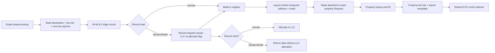
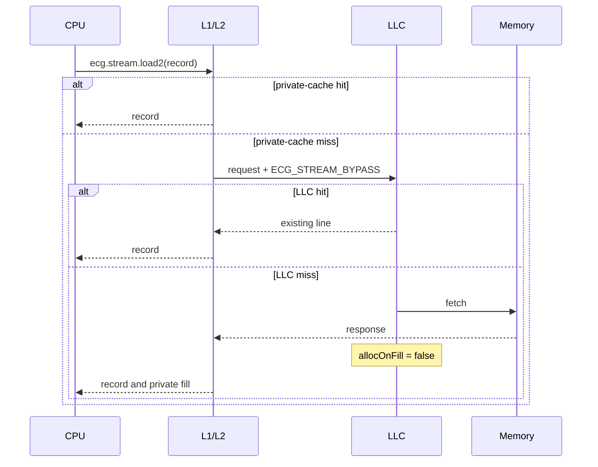

# ECG Successor Architecture

## Objective

The architecture carries graph reuse information in the edge record that the
kernel already streams. The same in-band information controls:

1. **replacement** — which property line should leave the LLC; and
2. **placement** — whether a one-touch record should allocate in the LLC.

The design targets four invariants:

- zero ECG-reserved LLC data ways, with metadata area charged separately;
- no hidden live rereference matrix;
- order-independent degree guidance carried with the edge;
- request-bound StreamShield placement.

The target implementation keeps the full configured LLC data capacity and
accepts a modest, separately reported metadata-area overhead. The 14/15-way
configurations are equal-silicon evaluation sensitivities, not reserved K2
data ways. K2 consumes its edge-carried records and never requires the live
P-OPT rereference matrix.

Current gem5 K2-I pair delivery is request-bound to the fused indexed property
load only in O3. Tiny unweighted PR and weighted SSSP O3 cells prove the pair
reaches the correct property line; TimingSimpleCPU scale runs use serialized
mailbox equivalence rather than a Request extension.

## K2 record

The canonical Schedule-2 record is 64 bits:

```text
63                 49 48                 34 33   32 31                  0
+---------------------+---------------------+-------+---------------------+
| epoch2 (15 bits)    | epoch1 (15 bits)    | tier  | destination (32)    |
+---------------------+---------------------+-------+---------------------+
```

`epoch1` and `epoch2` are the next two quantized rereference epochs for the
governed property line. They are constructed before the ROI and streamed with
the edge. `tier` is `1/2/3` for hot/moderate/cold; zero is invalid.
Fused sideband indexing drops zero-tier records, so an invalid hint never
stamps LLC replacement metadata.

The preprocessing pass counts property readers in the kernel's traversal
direction, ranks vertices by that reuse count, assigns the top 15% hot and next
15% moderate by default, and stores the **hottest tier among all vertices
sharing the property cache line**. The tier therefore remains meaningful
without DBG physical ordering. K2 supports at most `N_e = 32768` circular
epochs so the complete record remains exactly eight bytes.

For `N_e` circular epochs and current epoch `c`, the distance to delivered epoch
`e` is:

```text
d(e, c) = (e + N_e - (c mod N_e)) mod N_e
```

K2 uses the nearer valid future reference:

```text
d_K2 = min(d(epoch1, c), d(epoch2, c))
```

The shared implementation is `ecg_policy::epochPairDistance`.

## End-to-end data flow


```mermaid
flowchart LR
    A[Graph preprocessing] --> B[Build destination + line tier + next two epochs]
    B --> C[64-bit K2 edge record]
    C --> D{Record load}
    D -->|normal| E[Mask in register]
    D -->|StreamShield| F[Record request carries LLC no-allocate flag]
    F --> E
    E --> G[ecg.k2.mload computed address + mask]
    G --> H[Mask attached to exact property Request]
    H --> I[Property lookup and fill]
    I --> J[Property-line tier + epoch metadata]
    J --> K[Shared ECG victim selector]
    F --> L{Record miss?}
    L -->|normal| M[Allocate in LLC]
    L -->|StreamShield| N[Return data without LLC allocation]
```

The graph stream supplies the mask and the masked property load carries it on
the governed demand Request. StreamShield remains on the record/sidecar request;
it never bypasses the property request. The request extension carries the tier
and both epochs through O3 without a shared mailbox race.

## Replacement policy

All simulators call the same victim selector in
`bench/include/ecg_victim_policy.h`.

Static paper arms remain explicit: PR uses `epoch_first`, while BFS uses
`degree_first`. The carried tier removes their dependency on DBG layout.

### Insertion

ECG uses the paper-faithful GRASP insertion tiers:

| Class | Initial 3-bit RRPV |
|---|---:|
| high reuse / hot | 1 |
| moderate reuse | 6 |
| cold, record, or non-property | 7 |

### Eviction

K2 does not replace RRIP or degree information universally. It supplies the
future-reuse ordering appropriate to each kernel:

- PR's monotonic iterative sweep benefits from epoch-first ordering.
- BFS and SSSP frontier order is data-dependent, so degree is the stable first
  signal and K2 is a tie-break.
- BC and CC use `rrip_first`: their backward or pointer-chasing phases are not
  a monotonic edge sweep, so only forward edge-governed loads deliver or refresh
  K2 metadata.
- BC K2 delivery covers the forward Brandes BFS. Its runtime successor-DAG
  backward phase has no stable static edge-record position and delivers no new
  K2 epoch.
- The forward `path_counts[dest]` load reuses the edge's `depth[dest]` K2 mask.
  This avoids a second record stream; it is shared guidance, not an independent
  path-count reuse forecast.
- CC K2 delivery follows its OUT-edge records and is certified only for the
  algorithm's existing undirected/symmetric-graph contract. Dynamic union-find
  pointer chasing and compression deliver no new edge epoch.

K2 scope is request-bound at delivery, but the resulting epoch is line-resident
replacement metadata. A later plain access does not eagerly scrub a previously
stamped resident line; the stamp remains until replacement or a later governed
load updates it. The artifact therefore claims exact governed-load delivery,
not per-access erasure of all prior line metadata.

### Online set dueling

`ECG:K2_ONLINE` removes the pre-run kernel-to-policy choice. Five of every 64
LLC sets are fixed leader sets:

| Leader arm | Victim rule |
|---|---|
| `rrip_first` | RRIP gate, records first, then K2 |
| `grasp_only` | GRASP insertion with pure RRIP eviction |
| `epoch_first` | records first, then farthest K2 |
| `degree_first` | RRIP gate, coldest carried tier, then K2 |
| `lru_only` | oldest line |

Follower sets use the arm with the fewest sampled leader misses. Counts reset
every 1024 leader misses so the choice can follow phase changes. The selector is
graph- and kernel-name agnostic and is live in cache_sim, gem5, and Sniper.
Tiered K2 construction, delivery, and victim checks are first-class for
PR/BFS/SSSP/BC/CC in cache_sim, gem5, and Sniper.

### Adaptive StreamShield placement

`ECG:K2_ONLINE_ADAPTIVE_STREAMSHIELD` adds a separate two-arm placement duel:

- set slot 5 always allocates eligible K2 records in the LLC;
- set slot 6 always applies StreamShield;
- the other 62/64 sets follow the current placement winner.

Both leaders count total LLC misses, including property pollution and record
reuse effects. Every 1024 sampled leader misses, the lower-miss placement wins;
ties and startup choose allocation as the safe default. This selector is
independent of the five-arm property victim selector.

## StreamShield placement

StreamShield identifies packed record requests that should remain useful in the
private hierarchy but should not pollute the shared LLC.


```mermaid
sequenceDiagram
    participant CPU
    participant L1L2 as L1/L2
    participant LLC
    participant MEM as Memory
    CPU->>L1L2: ecg.stream.load2(record)
    alt private-cache hit
        L1L2-->>CPU: record
    else private-cache miss
        L1L2->>LLC: request + ECG_STREAM_BYPASS
        alt LLC hit
            LLC-->>L1L2: existing line
            L1L2-->>CPU: record
        else LLC miss
            LLC->>MEM: fetch
            MEM-->>L1L2: response
            Note over LLC: allocOnFill = false
            L1L2-->>CPU: record and private fill
        end
    end
```

StreamShield therefore preserves:

- L1/L2 fills;
- LLC tag lookup and LLC hits;
- normal memory ordering.

It suppresses only the returning LLC miss insertion. Derived gem5 stride
prefetches inherit the same request flag.

## ISA contract

The v2 contract separates the cache novelty from indexed-address fusion.

### Canonical core: computed-address masked load

| Instruction | Operands | Effect |
|---|---|---|
| `ecg.k2.mload.u32 rd, (rs1), rs2` | computed address + mask | zero-extending 32-bit integer load with K2 request metadata |
| `ecg.k2.mload.s32 rd, (rs1), rs2` | computed address + mask | sign-extending 32-bit integer load with K2 request metadata |
| `ecg.k2.mload.u64 rd, (rs1), rs2` | computed address + mask | 64-bit integer load with K2 request metadata |
| `ecg.k2.mload.f32 fd, (rs1), rs2` | computed address + mask | bit-preserving 32-bit floating-point load into the FP register file |

`EA = rs1`: K2-M does not decode `dest` or remove address-generation work. It
replaces the ordinary property load one-for-one. Record width, destination
extraction, address generation, and the current-epoch update remain charged.
This request-bound metadata interface is the core paper contribution.

### Optional extension: fused indexed masked load

| Instruction | Operands | Effect |
|---|---|---|
| `ecg.k2.iload.u32.d32 rd, rs1, rs2` | property base + `dest32|tier|epochs` record | indexed zero-extending 32-bit integer load |
| `ecg.k2.iload.u64.d32 rd, rs1, rs2` | same D32 layout | indexed 64-bit integer load |
| `ecg.k2.iload.u32.cw24 rd, rs1, rs2` | property base + compact `dest24|weight8|tier|epochs` record | indexed compact-weighted 32-bit property load |

K2-I may remove destination extraction/address-generation instructions. It is
an optional ISA/layout optimization and must be reported separately from K2-M.
Existing gem5 modes implement only the listed prototype subset: `0x03` =
U32.D32, `0x04` = U64.D32, and `0x05` = U32.CW24. They do not yet implement
signed or FP destinations. K2-M is added under distinct modes.

The implemented K2-M prototype modes are `0x06` U32.D32, `0x07` S32.D32,
`0x08` U64.D32, `0x09` U32.CW24, and `0x0A` F32.D32. All use `EA=rs1`.

StreamShield remains orthogonal:

| Instruction | Effect |
|---|---|
| `ecg.stream.load2 rd, 0(rs1)` | load an unweighted K2 record; suppress only its LLC miss allocation |
| `ecg.stream.wload2 rd, rs1, rs2` | load the weighted sidecar with the same record-only placement hint |

For compact weighted SSSP, one 8-byte
`dest24|weight8|tier2|epoch1_15|epoch2_15` record replaces the original
8-byte weighted edge. Larger IDs or weights fail closed to the 8-byte edge plus
4-byte sidecar path.

### Current-epoch channel

Absolute future epochs require a current epoch. The architectural contract uses
a per-hart `ecg.cur_epoch` CSR updated once per outer source/frontier vertex and
a per-hart context CSR set at graph/phase boundaries. The runtime maps
`{ASID/VMID, graph_generation}` to a 16-bit context ID that is unique among
active contexts; an ID may be reused only after its resident metadata is
invalidated. A K2-M or K2-I load snapshots the context ID, current epoch, and a
per-hart program-order K2 sequence number onto its exact Request. The LLC uses
this state only for that governed request; an ordinary or invalid-context
allocation falls back to degree/RRIP behavior.

The CSR write is architecturally ordered before subsequent K2 loads, saved and
restored on a context switch, and charged in the instruction stream. The line
stores the context ID so stale metadata fails closed after a graph or phase
change. ID reuse requires draining in-flight K2 requests and an explicit
metadata invalidation/LLC-flush operation; its latency is charged. The 32-bit
per-hart sequence does not wrap within a context. A runtime approaching wrap
must drain and allocate a fresh context ID. Request
queues/MSHRs preserve hart identity, sequence, epoch, and context. The prototype
`GEM5_SET_VERTEX`/Sniper magic channel is not the final ISA.

gem5 now implements `ecg.cur_epoch` and `ecg.context` as user-level custom
RISC-V CSRs `0x800` and `0x801`. Each K2 load snapshots both registers plus the
O3 dynamic instruction sequence onto its Request. The benchmark allocates a
monotonic nonzero context ID, writes it once inside the ROI, and writes the
quantized current epoch once per outer vertex/frontier item. It clears both CSRs
at context end and refuses ID reuse; exhaustion fails closed rather than
aliasing stale resident metadata. Explicit drain/invalidation for systems that
choose to reuse IDs remain pending. Sniper does not execute the RISC-V CSRs,
but its transport-matched model now snapshots a per-core current epoch and
monotonic ROI context on the exact governed-load marker. Serialized
X86/Timing compatibility publishes the same monotonic ID through its m5 hint
channel and clears it at the ordered context end. Older demand loads have
completed; any late prefetch fill fails closed on context mismatch. This
compatibility path is not the multicore architectural authority.

All participating harts in one graph context use the same global vertex/epoch
domain and runtime-assigned generation. A completed same-context LLC access from
any hart may therefore replace resident metadata in cache service order, and
any hart in that context may consume it using its own request-carried current
epoch. Only simultaneously coalesced cross-hart requests are unordered.

### MSHR, replay, and fault semantics

- A successful K2 access may update line metadata; a faulting access may not.
- Same-hart, same-context requests coalesced in one MSHR keep the greatest
  program-order K2 sequence number assigned before execution.
- Cross-hart requests are incomparable; a merge sets an irrevocable conflict
  bit for that MSHR.
- A different-context merge also sets the conflict bit.
- Once conflicted, no later target may restore metadata before MSHR retirement;
  the fill is unstamped and uses degree/RRIP.
- Replays of the same request ID are idempotent. Squashed speculative loads
  follow ordinary cache side-effect semantics: an already-issued successful
  fill is not rolled back.
- Split accesses carry metadata independently per touched line.

These rules must be mutation-tested in gem5 before OoO correctness is claimed.
The classic-cache implementation now aggregates K2 targets in each MSHR and a
standalone mutation test covers latest-sequence selection, replay idempotence,
cross-hart/context conflicts, invalid context, and ordinary-request conflicts.
Integrated OoO stress remains a gate before the multicore claim.

## Worked K2 example

Assume `N_e = 256` and current epoch `c = 10`.

| Resident property line | K2 epochs | Effective distance |
|---|---|---:|
| A | `(12, 40)` | `min(2, 30) = 2` |
| B | `(20, 30)` | `min(10, 20) = 10` |
| C | `(11, 13)` | `min(1, 3) = 1` |

If these lines are otherwise tied, epoch-first eviction selects **B** because
its next use is farthest away. A record line is handled by the record-first
placement/recency rule rather than pretending its epoch is meaningful.

## Comparison with prior policies

| Policy | Main signal | Extra structure | Reserved LLC data ways | Placement control |
|---|---|---|---:|---|
| LRU | recency | none | 0 | no |
| SRRIP | predicted interval from generic insertion/aging | per-line RRPV | 0 | no |
| Hawkeye | OPTgen-trained instruction-PC friendliness | sampled sets + PC predictor + per-line RRPV | 0 | no |
| GRASP | degree/address hotness + RRIP | reordered hot/moderate regions | 0 | no |
| P-OPT | live next-reference distance | rereference matrix | charged ways | no |
| ECG K2-M | carried line tier + RRIP + two future epochs | 8-byte edge record + at least 33 metadata bits/line | 0 | no |
| ECG K2-M online | sampled best of five victim rules | same record/line state + counters | 0 | no |
| ECG K2-M+StreamShield | same as K2-M | same state + request bit | 0 | LLC no-allocate |

The future headline comparison reports all five baselines plus static/online
K2-M with and without StreamShield. A cache_sim `HAWKEYE_PROXY` uses static
graph-access-site IDs because the functional model has no instruction PC; it is
diagnostic only. The faithful Hawkeye row must come from gem5's real request PC.
K2-I remains a separate ISA ablation.

## Simulator realization

| Surface | cache_sim | gem5 | Sniper |
|---|---|---|---|
| K2 construction | shared builder | shared builder | shared builder |
| K2 distance | shared selector | shared selector | shared selector |
| Tier delivery | masked property access | K2-M and K2-I implemented; O3 Request binding; serialized scale fallback | transport-matched K2-M with an identical explicit marker around each edge-governed destination load |
| Online selection | exact set index | gem5 replaceable-entry set | Sniper cache-set index |
| Epoch delivery | masked property access | K2-M exact Request proven for PR and compact SSSP O3; all five pass serialized scale gate | exact governed-load association with bind-time current-epoch/context snapshot; sideband supplies the line-min K2 payload |
| StreamShield | preserve LLC hits, suppress miss insertion | request flag clears LLC `allocOnFill` | preserve NUCA hit path, suppress miss insertion |
| Address stability | aligned properties + fixed indexed record streams | aligned properties/records | aligned properties/records |
| Purpose | functional authority | cycle-accurate ISA confirmation | scale/timing confirmation |

## Hardware cost model

- Unweighted K2 record: 8 bytes per edge record.
- Weighted SSSP: compact 8-byte replacement record when eligible; otherwise the
  existing 8-byte weighted edge plus a 4-byte K2 sidecar.
- ECG-reserved LLC data ways: 0; this is not zero hardware overhead.
- The primary equal-data-capacity design retains all 16 data ways and reports
  metadata SRAM/logic area, energy, and delay separately.
- StreamShield state: one request flag propagated through the hierarchy.
- Minimum K2 per-line metadata: two 15-bit epochs, 2-bit tier, and one valid bit
  = 33 bits/line. This is 6.45% of 64-byte data-array bits, approximately one
  data way in a 16-way cache. Context/generation state and ECC increase it.
- With the specified 16-bit context ID, K2 stores 49 bits/line before ECC:
  9.57% of data bits or 1.531 baseline-way equivalents. For an 8 MiB LLC,
  802,816 bytes is only the bit-packed metadata payload lower bound; physical
  SRAM additionally pays ECC, banking, ports, periphery, and logic.
- The self-consistent equal-area capacity is 14.602 fractional ways. A 15-way
  first sensitivity exceeds the simple bit budget by 2.72%; 14 integral ways
  use 95.87% of that budget. These are robustness sensitivities rather than a
  requirement to implement K2 by removing data ways.
- Transient request state additionally carries the current epoch and context
  ID plus sequence through the LSU, queues, MSHRs, and cache hierarchy. The v2
  logical payload is 95 bits per request instance before valid bits, hart/routing
  identity, ECC, and replication across pipeline/queue/interconnect structures.
  Per-hart persistent state additionally includes a 32-bit sequence counter.
- Online selector: five sampled leader classes plus small miss counters; no
  per-line selector state.
- Adaptive StreamShield: two disjoint placement leaders, two miss counters, and
  one winner bit; no per-line state.
- gem5 O3 uses the implemented request-bound K2 pair extension; only tiny
  instruction-correctness cells are in scope because O3 scale is prohibitively slow.
- P-OPT comparison: charged for its active rereference-matrix capacity and
  matrix traffic. K2 performs no runtime lookup of that structure.
- Headline comparison requires SRAM/logic energy and replacement-latency
  estimates plus an equal-silicon-area sensitivity; “no reserved data way”
  cannot be presented as “lower total hardware cost” until that gate passes.
- The artifact's physical harness accepts measured CACTI/synthesis components
  only. Its reduced-way calculation is explicitly labeled a linear sensitivity;
  measured 14/15-way CACTI points remain preferable.

The artifact rejects hidden matrices, zero-latency bypass, and aggressive
per-access LLC metadata broadcasts in headline rows.

## Evaluation flow


```mermaid
flowchart LR
    A[Correctness tests] --> B[Equal-capacity static-arm and online-regret baseline]
    B --> C[Hardware-faithful K1/K2 x StreamShield factorial]
    C --> D[gem5 synthetic ISA/mechanism profile]
    D --> E[Sniper synthetic mechanism profile]
    E --> F[Sniper web-Google eight-policy matrix]
    F --> G[Complete-matrix hash and policy-set checks]
    G --> H[Paper tables, online regret, and figures]
```

The final claim is frozen only after every required policy completes with the
same graph, cache geometry, prefetch degree, ROI, binary fingerprints, and
configuration hash.
