# AdaptiveOrder: ML-Powered Algorithm Selection

AdaptiveOrder (algorithm 14) uses **machine learning models** (perceptron, decision tree, hybrid, and database-driven kNN) to automatically select the best reordering algorithm for your graph. This page explains how it works and how to train it.

## Overview

Instead of requiring the user to pick a reordering algorithm, AdaptiveOrder:
1. **Computes graph features** (degree variance, hub concentration, packing factor, etc.)
2. **Queries the streaming database** (`benchmarks.json` + `graph_properties.json`) for oracle/kNN predictions
3. **Falls back to perceptron weights** from `adaptive_models.json` if the database is empty
4. **Applies the selected algorithm** to the entire graph

AdaptiveOrder operates in **full-graph mode**: it selects a single algorithm for the entire graph based on global features. This was found to outperform per-community selection because training data is whole-graph, so features match better, there is no Leiden partitioning overhead, and cross-community edge patterns are preserved.

## Command-Line Format

```bash
# Format: -o 14[:_[:_[:_[:selection_mode[:graph_name]]]]]
#   Positions 0-2 are reserved (currently unused)
#   Position 3 = selection_mode (0-6)
#   Position 4 = graph_name (string)

# Default: full-graph selection with fastest-execution mode
./bench/bin/pr -f graph.sg -s -o 14 -n 3

# Specify selection mode (position 3) — use colons to skip reserved positions
./bench/bin/pr -f graph.sg -s -o 14::::

# Use decision-tree mode
./bench/bin/pr -f graph.sg -s -o 14::::4

# Use database mode with graph name hint
./bench/bin/pr -f graph.sg -s -o 14::::6:web-Google
```

### Parameters

| Parameter | Position | Default | Description |
|-----------|----------|---------|-------------|
| `selection_mode` | 3 | 1 (fastest-execution) | 0–6, see Selection Modes table below |
| `graph_name` | 4 | (empty) | Graph name hint for weight/database lookup |

### Selection Modes

| Mode | Name | Description |
|------|------|-------------|
| 0 | `fastest-reorder` | Select algorithm with lowest reordering time |
| 1 | `fastest-execution` | Use perceptron to predict best cache performance (default) |
| 2 | `best-endtoend` | Balance perceptron score with reorder time penalty |
| 3 | `best-amortization` | Minimize iterations to amortize reorder cost |
| 4 | `decision-tree` | Decision Tree classifier per-benchmark (auto-depth, sklearn) |
| 5 | `hybrid` | Hybrid DT+Perceptron: DT for initial selection, perceptron for tie-breaking |
| 6 | `database` | Oracle and kNN-based algorithm selection from database |

## Architecture Diagram

```
+------------------+
|   INPUT GRAPH    |
+--------+---------+
         |
         v
+------------------+
| ComputeSampled   |
| DegreeFeatures   |
| (5000 samples)   |
+--------+---------+
         |
         v
+-----------------------------------+
| PRIMARY: Streaming Database       |
|   benchmarks.json +               |
|   graph_properties.json           |
|   → Oracle (known graph)          |
|   → kNN (unknown graph)           |
+--------+--------------------------+
         |  (empty DB? fallback ↓)
         v
+-----------------------------------+
| FALLBACK: Perceptron / Model Tree |
|  0-3: Perceptron (adaptive_models)|
|    4: Decision Tree (sklearn)     |
|    5: Hybrid DT + Perceptron      |
+--------+--------------------------+
         |
         v
+------------------+
| Safety Checks    |
| (OOD, Margin,    |
|  Complexity)     |
+--------+---------+
         |
         v
+------------------+
| Apply Selected   |
|   Algorithm      |
+------------------+
```

## Auto-Clustering Type System

AdaptiveOrder uses automatic clustering to group similar graphs during Python training, rather than predefined categories:

**How It Works (Training Side):**
1. Extract 7 features per graph: modularity, log_nodes, log_edges, avg_degree, degree_variance, hub_concentration, clustering_coefficient
2. Cluster similar graphs using k-means-like clustering
3. Train optimized weights for each cluster
4. Export trained weights to `adaptive_models.json`

**Unified Model Store:**

All trained models (perceptron weights, decision trees, hybrid parameters) are stored in a single file:
```
results/data/adaptive_models.json   # Unified model store (all benchmarks)
```
Managed by the `BenchmarkStore` class in `scripts/lib/core/datastore.py`. The C++ runtime loads this via `reorder_database.h`.

## Type Matching (Training Only)

During Python training, each type has a **centroid** — the average feature vector of its training graphs. New graphs are assigned to the nearest centroid by Euclidean distance. This clustering happens offline during `compute_weights_from_results()` and the resulting weights are exported to `adaptive_models.json`. The C++ runtime does not perform centroid matching — it loads pre-trained weights directly.

## How to Use

### Basic Usage

```bash
# Let AdaptiveOrder choose automatically
./bench/bin/pr -f graph.sg -s -o 14 -n 3
```

### Output Explained

```
=== Full-Graph Adaptive Mode (Standalone) ===
Nodes: 75879, Edges: 508837
Graph Type: social
Degree Variance: 1.9441
Hub Concentration: 0.5686

=== Selected Algorithm: GraphBrewOrder ===
```

This shows:
- Graph size and detected graph type
- Key structural features
- Which algorithm was selected

---

## The Perceptron Model

### What is a Perceptron?

A **perceptron** is the simplest form of a neural network - a linear classifier that computes a weighted sum of inputs.

**Mathematical Formula:**
```
output = activation(sum(w_i * x_i) + bias)

Where:
  x_i = input features (modularity, density, etc.)
  w_i = learned weights (how important each feature is)
  bias = base score (algorithm's inherent quality)
```

**Why Perceptron for GraphBrew?**
1. **Interpretable**: Each weight tells us feature importance
2. **Fast**: O(n) computation where n = number of features
3. **Online Learning**: Can update weights incrementally
4. **No Overfitting**: Simple model generalizes well

For multi-class selection, we use **one perceptron per algorithm**. Each computes a score, and we pick the algorithm with the **highest score**.

### Perceptron Scoring Diagram

```
INPUTS (Features)              WEIGHTS                    OUTPUT
=================              =======                    ======

--- Linear Features (active at runtime) ---
modularity             --*---> w_mod ----------------+
log_nodes              --*---> w_log_nodes ----------+
log_edges              --*---> w_log_edges ----------+
density                --*---> w_den ----------------+
avg_degree             --*---> w_avg_deg ------------+
degree_var             --*---> w_dv -----------------+
hub_conc               --*---> w_hc -----------------+
cluster_coef           --*---> w_cc -----------------+
avg_path_length        --*---> w_apl ----------------+
diameter               --*---> w_diam ---------------+
community_count        --*---> w_comcount -----------+
packing_factor         --*---> w_pf -----------------+----> SUM
fwd_edge_frac          --*---> w_fef ----------------+    (+bias)
working_set_ratio      --*---> w_wsr ----------------+      |
reorder_time           --*---> w_reorder_time -------+      |
                                                      |      |
--- Quadratic Cross-Terms ---                         |      |
dv × hub               --*---> w_dv_x_hub -----------+      |
mod × logN             --*---> w_mod_x_logn ---------+      +---> SCORE
pf × log₂(wsr+1)      --*---> w_pf_x_wsr -----------+      |
                                                      |      |
--- Convergence Bonus (PR/PR_SPMV/SSSP only) ---      |      |
fwd_edge_frac          --*---> w_fef_conv -----------+------+


ALGORITHM SELECTION:
====================
RABBITORDER:    score = 2.31  <-- WINNER
GraphBrewOrder: score = 2.18
HubClusterDBG:  score = 1.95
GORDER:         score = 1.82
ORIGINAL:       score = 0.50

SAFETY CHECKS:
==============
1. OOD Guardrail: If type distance > 1.5 → force ORIGINAL
2. ORIGINAL Margin: If best - ORIGINAL < 0.05 → keep ORIGINAL
```

### Features Used

The C++ code computes these features at runtime via `ComputeSampledDegreeFeatures` (auto-scaled sample) and `ComputeExtendedFeatures` (sampled BFS):

#### Adaptive Sample Size

The sample size for degree-based features auto-scales with graph size:

```
sample_size = max(5000, min(√N, 50000))
```

| Graph Size (N) | Sample Size | Coverage |
|---------------:|:-----------:|---------:|
| 10K | 5,000 | 50.0% |
| 100K | 5,000 | 5.0% |
| 1M | 5,000 | 0.50% |
| 25M | 5,000 | 0.02% |
| 100M | 10,000 | 0.01% |
| 1B | 31,623 | 0.003% |
| 10B+ | 50,000 | cap |

**Why this is enough:** Strided sampling (evenly spaced across vertex IDs) provides spatial coverage proportional to the sample size, which is sufficient for degree statistics on power-law graphs because degree-distribution moments converge quickly — 5000 samples give <1% error on variance/mean estimates for typical power-law exponents (α ∈ [2, 3]). For very large graphs (>25M) we increase the sample to maintain significance on secondary features like hub concentration and packing factor. The 50K cap bounds overhead at ~0.5% of graph size.

#### Active Linear Features (11)

| Feature | Weight Field | Description | Range |
|---------|--------------|-------------|-------|
| `modularity` | `w_modularity` | Real modularity from graph features (CC×1.5 fallback) | 0.0 - 1.0 |
| `log_nodes` | `w_log_nodes` | log10(num_nodes + 1) | 0 - 10 |
| `log_edges` | `w_log_edges` | log10(num_edges + 1) | 0 - 15 |
| `density` | `w_density` | edges / max_edges | 0.0 - 1.0 |
| `avg_degree` | `w_avg_degree` | mean degree / 100 | 0.0 - 1.0 |
| `degree_variance` | `w_degree_variance` | degree distribution spread (CV) | 0.0 - 5.0 |
| `hub_concentration` | `w_hub_concentration` | fraction of edges from top 10% | 0.0 - 1.0 |
| `clustering_coeff` | `w_clustering_coeff` | local clustering (sampled) | 0.0 - 1.0 |
| `packing_factor` | `w_packing_factor` | hub neighbor co-location (IISWC'18) | 0.0 - 1.0 |
| `forward_edge_fraction` | `w_forward_edge_fraction` | edges to higher-ID vertices (GoGraph) | 0.0 - 1.0 |
| `working_set_ratio` | `w_working_set_ratio` | log₂(graph_bytes / LLC_size + 1) (P-OPT) | 0 - 10 |

#### Extended Structural Features (computed via `ComputeExtendedFeatures`)

These features are computed at runtime via sampled BFS traversals and connected-component counting. They complement degree-based features with path-based and connectivity information:

| Feature | Weight Field | Computation | Overhead |
|---------|--------------|-------------|----------|
| `avg_path_length` | `w_avg_path_length` | Multi-source BFS (5 sources, bounded visits) | ~50-500 ms |
| `diameter_estimate` | `w_diameter` | Max BFS depth across sources | (included above) |
| `community_count` | `w_community_count` | log10(connected component count + 1) | O(V+E) |
| `reorder_time` | `w_reorder_time` | Only meaningful in `MODE_FASTEST_REORDER` | N/A |

**How extended features are computed:**

- **avg_path_length** — BFS from 5 evenly-spaced source vertices, each visiting at most min(100K, N/10) nodes. The average distance across all BFS-discovered pairs gives an estimate of the graph's "small-world-ness". Short average paths (< 5) indicate social/web graphs that benefit from community-aware reorderings.

- **diameter_estimate** — Maximum BFS depth observed across all 5 sources. This is a lower bound on the true diameter. High-diameter graphs (road networks, meshes) benefit from bandwidth-minimizing reorderings (RCM), while low-diameter graphs (social networks) benefit from hub-based reorderings.

- **community_count** — Number of connected components found via a full BFS sweep over all vertices. Transformed as `log10(community_count + 1)` before scoring. Multi-component graphs benefit from reorderings that place each component contiguously in memory. Note: this counts connected components, not Leiden communities (which would be too expensive at runtime).

#### Quadratic Cross-Terms (3)

Quadratic cross-terms capture **non-linear feature interactions** that a linear model cannot represent. Each cross-term is the product of two features, allowing the perceptron to learn conditional logic like "this algorithm wins when *both* conditions hold simultaneously":

| Interaction | Weight Field | What It Captures | When It Matters |
|-------------|--------------|------------------|-----------------|
| degree_variance × hub_concentration | `w_dv_x_hub` | **Power-law indicator.** High DV + high HC = classic power-law topology. Hub-aware algorithms (HubClusterDBG, GraphBrewOrder) shine here because concentrating hubs in cache dramatically reduces random access. | Social networks, web graphs |
| modularity × log₁₀(nodes) | `w_mod_x_logn` | **Scalable community structure.** A 1000-node modular graph differs from a 10M-node modular graph — larger modular graphs benefit more from Leiden-based reorderings because the modularity "payoff" scales with community size. | Large social/citation networks |
| packing_factor × log₂(wsr+1) | `w_pf_x_wsr` | **Uniform-degree + cache pressure.** High packing (neighbors already co-located) combined with high WSR (graph overflows LLC) signals a graph where current ordering is locally good but globally poor — reordering the inter-community edges helps. | Road networks, meshes |

**Why 3 cross-terms?** These were selected because they capture the three dominant interaction effects observed in correlation analysis: (1) power-law structure, (2) scale-dependent community quality, and (3) locality-vs-capacity trade-off. Adding more cross-terms risks overfitting on small training sets.

#### Convergence Bonus (1)

| Feature | Weight Field | Description |
|---------|--------------|-------------|
| forward_edge_fraction | `w_fef_convergence` | Added only for PR/PR_SPMV/SSSP benchmarks |

The convergence bonus is separate from the linear `w_forward_edge_fraction` term because iterative algorithms (PageRank, SSSP) benefit *doubly* from forward-edge-heavy orderings: once through locality (captured by the linear term) and once through faster Gauss-Seidel convergence (captured by this bonus). Non-iterative algorithms (BFS, CC, TC) only get the locality benefit.

### Why Each Weight Was Chosen

Each weight in the perceptron corresponds to a graph structural feature that empirically correlates with algorithm performance. Here is what each weight captures and how it influences algorithm selection:

```mermaid
graph TD
    subgraph "Feature Categories"
        A["🔬 Core Topology<br/>modularity, density,<br/>degree_variance,<br/>hub_concentration"]
        B["📏 Scale Features<br/>log_nodes, log_edges,<br/>avg_degree"]
        C["🗺️ Locality Features<br/>packing_factor,<br/>fwd_edge_fraction,<br/>working_set_ratio"]
        D["📐 Path Features<br/>avg_path_length,<br/>diameter_estimate,<br/>community_count"]
        E["✖️ Cross-Terms<br/>dv×hub, mod×logN,<br/>pf×log₂(wsr)"]
    end

    A --> F["scoreBase()"]
    B --> F
    C --> F
    D --> F
    E --> F
    F --> G["× benchmark_multiplier"]
    G --> H["Final Score per Algorithm"]
    H --> I{"Highest Score Wins"}
```



#### Core Topology Weights

| Weight | Why Picked | Effect on Selection |
|--------|-----------|---------------------|
| **bias** | Base preference for each algorithm, computed as `0.5 × avg_speedup_vs_RANDOM`. Acts as a prior — algorithms that are generally fast get a head start. | Algorithms that are generally fast across graphs get higher bias values. ORIGINAL has the lowest bias since it is the baseline reference. |
| **w_modularity** | Community structure quality. Uses real modularity from graph features when available; falls back to `min(0.9, clustering_coeff × 1.5)` heuristic. High modularity = strong communities → community-aware reorderings (GraphBrewOrder, LeidenOrder) can exploit this structure. | Positive weight → favors community-aware algorithms. Negative weight → favors simpler algorithms (SORT, DBG) that ignore community structure. |
| **w_density** | Edge density = edges / max_possible. Dense graphs have many edges per vertex → less locality gain from reordering since most vertices are neighbors anyway. | Typically negative for reordering algorithms (less benefit on dense graphs), near-zero for ORIGINAL. |
| **w_degree_variance** | Degree distribution spread (coefficient of variation). High DV = power-law graph with extreme hubs. Hub-based algorithms (HubSort, HubClusterDBG) excel because grouping hubs reduces cache misses. | Positive for hub-aware algorithms, negative for algorithms that ignore hubs (SORT, RCM). |
| **w_hub_concentration** | Fraction of edges from the top 10% highest-degree vertices. Directly measures how much performance depends on hub access patterns. | Strong positive for HubClusterDBG, HubSortDBG. Near-zero for SORT, RCM. |

#### Scale Weights

| Weight | Why Picked | Effect on Selection |
|--------|-----------|---------------------|
| **w_log_nodes** | Logarithmic node count. Larger graphs benefit more from reordering because the cache miss penalty increases with working set size. | Positive for all reordering algorithms, negative for ORIGINAL (which becomes worse as graphs grow). |
| **w_log_edges** | Logarithmic edge count. More edges = more memory accesses = more opportunity for reordering to help. Often correlated with `log_nodes` but captures edge-heavy graphs independently. | Similar to `w_log_nodes` but distinguishes sparse vs. dense at the same node count. |
| **w_avg_degree** | Mean vertex degree / 100 (normalized). High average degree means each vertex touches many neighbors → random access pattern depends heavily on vertex ordering. | Positive for locality-aware algorithms. Near-zero for algorithms that only sort by degree. |

#### Locality Weights (Paper-Motivated)

| Weight | Source Paper | Why Picked | Effect on Selection |
|--------|-------------|-----------|---------------------|
| **w_packing_factor** | IISWC'18 | Measures what fraction of a hub's neighbors are already nearby in memory (within a locality window of N/100 vertex IDs). High packing = current ordering already has good locality → less benefit from reordering. | Negative for aggressive reorderings (less room for improvement). Positive for ORIGINAL (already good). |
| **w_forward_edge_fraction** | GoGraph | Fraction of edges (u,v) where ID(u) < ID(v). High FEF = ordering already respects "data flow" direction → better for iterative convergence (PR, SSSP). | Positive for ORIGINAL (ordering already has good convergence properties). Negative for reorderings that disrupt forward-edge structure. |
| **w_working_set_ratio** | P-OPT | `log₂(graph_bytes / LLC_size + 1)`. How many times the graph overflows the last-level cache. WSR ≈ 1 = graph fits → reordering has limited benefit. WSR >> 1 = reordering critically important for cache performance. | Positive for reordering algorithms (more benefit when graph doesn't fit cache). |

#### Extended Structural Weights

| Weight | Why Picked | Effect on Selection |
|--------|-----------|---------------------|
| **w_clustering_coeff** | Local clustering coefficient (triangle density). Measures how "cliquey" neighborhoods are. High clustering → community-aware reorderings can group cliques together for better cache utilization. | Positive for GraphBrewOrder, LeidenOrder. Near-zero for degree-only algorithms. |
| **w_avg_path_length** | Average shortest path distance (sampled). Short paths (< 5) = small-world graph → hub-based reorderings help because traversals reach hubs quickly. Long paths (> 10) = spatial graph → bandwidth-minimization (RCM) is better. | Sign depends on algorithm: positive for RCM on high-APL graphs, positive for HubSort on low-APL graphs. |
| **w_diameter** | Maximum BFS depth (diameter lower bound). High-diameter graphs need different reordering strategies than low-diameter graphs — algorithms that reduce graph bandwidth (RCM) perform well on high-diameter road networks but poorly on low-diameter social networks. | Positive for RCM, negative for hub-based algorithms. |
| **w_community_count** | Connected component count, transformed as `log10(community_count + 1)`. Multiple disconnected components benefit from reorderings that place each component contiguously — keeps working set contained within a component. | Positive for algorithms that respect component structure (GraphBrewOrder). |

### Centroid-Based Type System

The perceptron uses a **type clustering system** to train different weights for different graph shapes. Instead of one-size-fits-all weights, graphs are clustered by structural similarity and each cluster gets its own trained weights.

```mermaid
flowchart LR
    subgraph "Training (Offline)"
        A["Graph Features<br/>7 dimensions"] -->|k-means-like| B["Type Centroids"]
        B --> C["type_0/ weights.json<br/>type_1/ weights.json<br/>..."]
    end

    subgraph "Runtime (Online)"
        D["New Graph<br/>Features"] -->|Euclidean distance| E{"Match Centroid?"}
        E -->|distance < 1.5| F["Load matching<br/>type weights"]
        E -->|distance ≥ 1.5| G["OOD Guardrail<br/>→ use ORIGINAL"]
    end
```



#### How Centroids Work

1. **Feature Vector (7D):** Each graph is represented by a normalized 7-dimensional vector:
   `[modularity, degree_variance, hub_concentration, avg_degree, clustering_coeff, log_nodes, log_edges]`
   
   Each dimension is normalized to [0,1] range:
   - modularity: / 1.0, degree_variance: / 5.0, hub_concentration: / 1.0
   - avg_degree: / 100.0, clustering_coeff: / 1.0
   - log_nodes: (log₁₀(N+1) - 3) / 7 (range [3,10]), log_edges: (log₁₀(E+1) - 3) / 9 (range [3,12])

2. **Clustering:** During training, the first graph creates `type_0` with its feature vector as the centroid. Subsequent graphs are assigned to the nearest type if their normalized Euclidean distance is < 0.15 (the `CLUSTER_DISTANCE_THRESHOLD`). If no type is close enough, a new type is created.

3. **Centroid Update:** When a graph joins an existing type, the centroid is updated as a running mean:
   ```
   new_centroid[i] = old_centroid[i] + (graph_feature[i] - old_centroid[i]) / (count + 1)
   ```

4. **Runtime Matching:** The graph's features are normalized and compared to all type centroids. The type with minimum Euclidean distance is selected. If minimum distance > 1.5, the graph is considered **out-of-distribution (OOD)** and ORIGINAL is returned as a safe default.

#### Centroid Distance Visualization

```
    High Mod  ┌────────────────────────────────────┐
              │  ●type_1                           │
              │   (social)     ○ new graph         │
              │                ↕ dist=0.12         │
              │  ●type_0       → matches type_1    │
              │   (web)                            │
              │                                    │
              │              ●type_2               │
              │               (road)               │
    Low Mod   └────────────────────────────────────┘
              Low DV                        High DV
```

> **Locality Features:** `packing_factor` (IISWC'18), `forward_edge_fraction` (GoGraph), and `working_set_ratio` (P-OPT) capture degree uniformity, ordering quality, and cache pressure respectively. The quadratic cross-terms capture non-linear feature interactions.

> **LLC Detection:** The `working_set_ratio` is computed by dividing the graph's memory footprint (offsets + edges + vertex data) by the system's L3 cache size, detected via `GetLLCSizeBytes()` using `sysconf(_SC_LEVEL3_CACHE_SIZE)` on Linux (30 MB fallback).

### C++ Code Architecture

AdaptiveOrder's implementation is split across modular header files in `bench/include/graphbrew/reorder/`:

| File | Purpose |
|------|---------|
| `reorder_types.h` | Base types, `PerceptronWeights`, `CommunityFeatures`, `ComputeSampledDegreeFeatures`, `ComputeExtendedFeatures`, scoring, weight loading |
| `reorder_adaptive.h` | Entry points: `GenerateAdaptiveMappingStandalone`, `FullGraphStandalone`, `RecursiveStandalone` |
| `reorder_database.h` | Database-driven selection (MODE_DATABASE=6): oracle lookup, kNN, unified model loading |

**ComputeSampledDegreeFeatures Utility:**

For fast topology analysis without computing over the entire graph:

```cpp
// bench/include/graphbrew/reorder/reorder_types.h
struct SampledDegreeFeatures {
    double degree_variance;        // Normalized degree variance (CV)
    double hub_concentration;      // Fraction of edges from top 10% degree nodes
    double avg_degree;             // Sampled average degree
    double clustering_coeff;       // Estimated clustering coefficient
    double estimated_modularity;   // Rough modularity estimate
    double packing_factor;         // Hub neighbor co-location (IISWC'18)
    double forward_edge_fraction;  // Fraction of edges (u,v) where u < v (GoGraph)
    double working_set_ratio;      // graph_bytes / LLC_size (P-OPT)
};

struct ExtendedFeatures {
    double avg_path_length;        // Mean BFS distance across sampled pairs
    int    diameter_estimate;      // Max BFS depth (lower bound on diameter)
    int    component_count;        // Number of connected components
};

template<typename GraphT>
SampledDegreeFeatures ComputeSampledDegreeFeatures(
    const GraphT& g,
    size_t sample_size = 0,       // 0 = auto-scale: max(5000, min(√N, 50000))
    bool compute_clustering = false
);

template<typename GraphT>
ExtendedFeatures ComputeExtendedFeatures(
    const GraphT& g,
    int num_bfs_sources = 5,      // Number of BFS sources for path/diameter
    size_t max_bfs_visits = 0     // 0 = auto-scale: min(100K, N/10)
);

// Detects system LLC size via sysconf (Linux) with 30MB fallback
size_t GetLLCSizeBytes();
```

**Key Functions in reorder_adaptive.h:**

```cpp
// Main entry point — always delegates to FullGraph
void GenerateAdaptiveMappingStandalone(
    const CSRGraph& g, pvector<NodeID_>& new_ids,
    bool useOutdeg, const std::vector<std::string>& reordering_options);
    // Reads: options[3] → selection_mode, options[4] → graph_name
    // Ignores: options[0..2]

// Full-graph adaptive selection (the actual implementation)
void GenerateAdaptiveMappingFullGraphStandalone(
    const CSRGraph& g, pvector<NodeID_>& new_ids,
    bool useOutdeg, const std::vector<std::string>& reordering_options);

// Per-community recursive selection (not called from CLI entry point)
void GenerateAdaptiveMappingRecursiveStandalone(
    const CSRGraph& g, pvector<NodeID_>& new_ids,
    bool useOutdeg, const std::vector<std::string>& reordering_options,
    int depth, bool verbose, SelectionMode mode, const std::string& graph_name);
```

**Complexity Guards:**

The full-graph path guards against expensive algorithms on large graphs:
- GOrder: capped at 500,000 nodes (O(n×m×w) complexity)
- COrder: capped at 2,000,000 nodes (O(n×m) complexity)
- Falls back to HubClusterDBG, HubSort, or DBG based on graph structure

### Weight Structure

Each algorithm has weights for each feature. See [[Perceptron-Weights#file-structure]] for full JSON format, all weight categories, and tuning strategies.

### Benchmark-Specific Scoring

The perceptron supports per-benchmark multipliers via `getBenchmarkMultiplier()` in each algorithm's weight entry. The final score is `base_score × benchmark_multiplier[type]`. Per-benchmark weights are stored in `adaptive_models.json` under the `per_benchmark` key and loaded via the DB hook.

```cpp
// C++ Usage (current entry points):
SelectReorderingWithMode(features, mode, bench, verbose);           // Primary: DB → fallback
SelectReorderingPerceptronWithFeatures(features, bench, verbose);   // Direct perceptron scoring
```

**Supported benchmarks:** PR, BFS, CC, SSSP, BC, TC, PR_SPMV, CC_SV

### Score Calculation (C++ Runtime)

```
base_score = bias
           + w_modularity × modularity
           + w_log_nodes × log10(nodes+1)
           + w_log_edges × log10(edges+1)
           + w_density × density
           + w_avg_degree × avg_degree / 100
           + w_degree_variance × degree_variance
           + w_hub_concentration × hub_concentration
           + w_clustering_coeff × clustering_coeff
           + w_avg_path_length × avg_path_length / 10
           + w_diameter × diameter_estimate / 50
           + w_community_count × log10(community_count + 1)
           + w_packing_factor × packing_factor
           + w_forward_edge_fraction × fwd_edge_frac
           + w_working_set_ratio × log₂(wsr+1)
           + w_reorder_time × reorder_time
           + w_dv_x_hub × dv × hub_conc                  # QUADRATIC
           + w_mod_x_logn × mod × logN                   # QUADRATIC
           + w_pf_x_wsr × pf × log₂(wsr+1)               # QUADRATIC
           + cache_l1_impact × 0.5                        # CACHE IMPACT
           + cache_l2_impact × 0.3                        # CACHE IMPACT
           + cache_l3_impact × 0.2                        # CACHE IMPACT
           + cache_dram_penalty                           # CACHE IMPACT

# Convergence bonus (PR/PR_SPMV/SSSP only)
if benchmark ∈ {PR, PR_SPMV, SSSP}:
    base_score += w_fef_convergence × forward_edge_fraction

# Final score with benchmark adjustment
final_score = base_score × benchmark_multiplier[benchmark_type]

# Safety checks (applied after scoring):
# 1. OOD Guardrail: type_distance > 1.5 → return ORIGINAL
# 2. ORIGINAL Margin: best - ORIGINAL < 0.05 → return ORIGINAL
```

---

## Training the Perceptron

### Quick Training Commands

```bash
# One-click: downloads graphs, runs benchmarks, generates weights
python3 scripts/graphbrew_experiment.py --full --size small

# Train from existing benchmark/cache results
python3 scripts/graphbrew_experiment.py --phase weights

# Complete training pipeline
python3 scripts/graphbrew_experiment.py --train --size small

# Iterative training to reach target accuracy
python3 scripts/graphbrew_experiment.py --train-iterative --target-accuracy 80 --size small

# Large-scale batched training
python3 scripts/graphbrew_experiment.py --train-batched --size medium --batch-size 8
```

For consistent benchmarks, use label mapping:
```bash
python3 scripts/graphbrew_experiment.py --generate-maps  # Generate once
python3 scripts/graphbrew_experiment.py --use-maps --phase benchmark  # Reuse
```

See [[Perceptron-Weights]] for the full training pipeline details, gradient update rule, and weight tuning strategies.

### Training Progression (Recommended)

1. **Quick test** on small graphs: `--train-iterative --size small --target-accuracy 75`
2. **Fine-tune** with medium graphs: `--train-iterative --size medium --target-accuracy 80 --learning-rate 0.05`
3. **Validate** on large graphs: `--brute-force --size large`

---

## Safety & Robustness

| Feature | Description |
|---------|-------------|
| **OOD Guardrail** | If graph features are > 1.5 Euclidean distance from all type centroids → return ORIGINAL |
| **ORIGINAL Margin** | If best algorithm's score − ORIGINAL's score < 0.05 → keep ORIGINAL |
| **Convergence Bonus** | For PR/PR_SPMV/SSSP: adds `w_fef_convergence × forward_edge_fraction` to reward forward-edge-heavy orderings |
| **L2 Regularization** | Weight decay `(1 − 1e-4)` after each gradient update prevents explosion |
| **ORIGINAL Trainable** | ORIGINAL is trained like any algorithm, allowing the model to learn when *not reordering* is optimal |

---

## Cross-Validation

Leave-One-Graph-Out (LOGO) validation measures generalization: hold out one graph, train on the rest, predict the held-out graph, repeat.

```python
from scripts.lib.ml.weights import cross_validate_logo
result = cross_validate_logo(benchmark_results, reorder_results=reorder_results, weights_dir=weights_dir)
print(f"LOGO: {result['accuracy']:.1%}, Overfit: {result['overfitting_score']:.2f}")
```

| Metric | Description |
|--------|-------------|
| LOGO Accuracy | Higher is better — measures generalization to unseen graphs |
| Overfitting Score | Lower is better — large gap between full-train and LOGO suggests overfitting |
| Full-Train Accuracy | Training set accuracy — very high values (>95%) may indicate overfitting |

---

## Advanced Training: `compute_weights_from_results()`

The primary training function in `lib/ml/weights.py` implements a 4-stage pipeline:

1. **Multi-Restart Perceptron Training** — 5 independent perceptrons × 800 epochs per benchmark, z-score normalized features, averaged across restarts and benchmarks
2. **Variant-Level Weight Saving** — All variants are saved directly (each has its own entry in C++ string-keyed weights); bias ordering set by mean-feature scoring for compatibility
3. **Regret-Aware Benchmark Multiplier Optimization** — Grid search (30 iterations × 32 values) maximizing accuracy while minimizing regret
4. **Stage to `type_0.json`** (merged into `adaptive_models.json` by `export_unified_models()`)

See [[Perceptron-Weights#multi-restart-training--benchmark-multipliers]] for details on the training internals.

### Validation with eval_weights

```bash
python3 scripts/graphbrew_experiment.py --eval-weights
```

Reports accuracy, median regret, top-2 accuracy, and unique predictions. Run `--eval-weights` on your own data to see current metrics.

### SSO Module Responsibilities (v1.3.0+)

The training and evaluation pipeline follows a strict **Single Source of Truth** architecture:

| Module | SSO Responsibility |
|--------|--------------------|
| `weights.py` → `PerceptronWeight` | Sole scoring formula (26-field dataclass: `compute_score()`) |
| `eval_weights.py` | Sole data loading (`load_all_results()`, `build_performance_matrix()`, `compute_graph_features()`, `find_best_algorithm()`) + evaluation reporting |
| `adaptive_emulator.py` | C++ emulation — delegates scoring to `PerceptronWeight.compute_score()` |
| `training.py` | Iterative/batched training — delegates weight defaults to `PerceptronWeight` |

See [[Perceptron-Weights#sso-architecture-v130]] and [[Code-Architecture#sso-single-source-of-truth-architecture]] for the full SSO design.

---

## How Correlation Analysis Works

The training pipeline benchmarks all algorithms on diverse graphs, extracts structural features, computes Pearson correlations between features and algorithm performance, and converts correlations to perceptron weights.

See [[Correlation-Analysis]] for the full 5-step process with examples.

---

## How Perceptron Scores Feed Into Ordering

### End-to-End Pipeline Diagram


### Feature Extraction Detail

The feature extraction pipeline runs two independent computations:


### Complete Example: Ordering a Social Network

For a graph with 10,000 nodes, AdaptiveOrder (default full-graph mode):

1. **Feature Extraction** — `ComputeSampledDegreeFeatures()` computes degree_variance, hub_concentration, packing_factor, forward_edge_fraction, working_set_ratio, clustering_coeff. `ComputeExtendedFeatures()` computes avg_path_length, diameter_estimate, component_count.
2. **Database Lookup** — `SelectReorderingWithMode()` calls `database::SelectForMode()`, which queries `benchmarks.json` for oracle/kNN predictions. If the database has data for this graph or similar graphs, the result is returned directly.
3. **Perceptron Fallback** — If the database is empty, `LoadPerceptronWeightsFromDB()` loads weights from `adaptive_models.json` and scores all algorithms using the perceptron formula.
4. **Algorithm Selection** — Selects the algorithm with the highest score (subject to safety checks: OOD guardrail, ORIGINAL margin, complexity guards)
5. **Reordering** — Applies the selected algorithm to the entire graph

---

## Decision Tree Model (MODE_DECISION_TREE = 4)

The Decision Tree (DT) selection mode uses a **C++ runtime-trained tree** stored in `adaptive_models.json`. Unlike the perceptron, the DT makes hard classification decisions based on feature thresholds — no weighted linear combination.

### How It Works

1. **Training** — C++ `train_decision_tree()` in `reorder_database.h` builds one tree per benchmark (pr, bfs, cc, sssp, bc, tc) using the same 12D graph features as the perceptron. Tree depth is auto-optimized to avoid overfitting.
2. **Storage** — Trained trees are serialized into `results/data/adaptive_models.json` under the `"decision_trees"` key, one entry per benchmark.
3. **Runtime** — The C++ code in `reorder_database.h` loads the DT rules from `adaptive_models.json` and traverses the tree to classify the input graph's feature vector.

### Advantages

- **Interpretable**: Tree structure shows exact decision rules (e.g., "if hub_concentration > 0.45 and log_nodes > 5.2 → RABBIT")
- **No scoring ambiguity**: Each leaf maps to exactly one algorithm family
- **No Python dependency**: Training and inference are both C++

### Training

DT models are trained automatically by the C++ runtime when ≥3 graphs are in the benchmark database. No separate training command is needed — simply run benchmarks and the models are updated in-place.

---

## Hybrid DT+Perceptron (MODE_HYBRID = 5)

The Hybrid mode combines **Decision Tree classification** with **perceptron scoring** for a best-of-both-worlds approach.

### How It Works

1. **DT Initial Selection** — The decision tree classifies the graph into an algorithm family (e.g., RABBIT, LEIDEN, HUBSORT)
2. **Perceptron Tie-Breaking** — Within the selected family (and close alternatives), the perceptron's continuous scores rank specific algorithm variants
3. **Final Selection** — The variant with the highest perceptron score from the DT-selected family wins

### Why Hybrid?

| Aspect | DT Only | Perceptron Only | Hybrid |
|--------|---------|----------------|--------|
| Decision boundary | Sharp (threshold) | Smooth (linear) | Sharp + smooth |
| Interpretability | High | Medium | High |
| Variant ranking | No (family only) | Yes (per-variant) | Yes |
| Overfitting risk | Low (auto-depth) | Low (simple model) | Lowest |

The hybrid approach uses the DT's strength at coarse-grained family selection (where threshold-based rules match the underlying structure) and the perceptron's strength at fine-grained variant ranking (where continuous scores differentiate similar algorithms).

### Storage

Hybrid parameters are stored in `results/data/adaptive_models.json` alongside the DT and perceptron models.

---

## Streaming Database Model (v2.0)

> **All modes now use the streaming database as their primary selection path.**
> The database IS the model — no pre-trained weight files are needed. When new
> benchmark data is appended, selection automatically improves for ALL modes
> without any Python retraining step.

Implemented in `bench/include/graphbrew/reorder/reorder_database.h` (`BenchmarkDatabase` singleton class).

### How It Works

1. **`SelectReorderingWithMode()`** first calls `SelectForMode()` which reads
   `benchmarks.json` + `graph_properties.json` directly
2. For **known graphs** (oracle): returns the algorithm with the lowest time
3. For **unknown graphs** (kNN): finds k=5 nearest graphs by 12D feature distance,
   computes per-algorithm scores weighted by inverse distance
4. Different modes use different scoring strategies on the same kNN data:

| Mode | Scoring Strategy |
|------|-----------------|
| 0: fastest_reorder | Pick algorithm with lowest avg `reorder_time` from neighbors |
| 1: fastest_execution | Pick algorithm with lowest avg `kernel_time` from neighbors |
| 2: best_endtoend | Pick algorithm with lowest `kernel_time + reorder_time` |
| 3: best_amortization | Pick algorithm with lowest `reorder_time / time_saved` |
| 4: decision_tree | DB kNN first, then DT model tree fallback |
| 5: hybrid | DB kNN first, then hybrid model tree fallback |
| 6: database | Same as mode 1 (explicit database selection) |

### Fallback: Perceptron Weights

If `benchmarks.json` is empty or missing, modes 0-3 fall back to
`PerceptronWeights` loaded from `adaptive_models.json`.
Modes 4-5 fall back to model tree files stored in `adaptive_models.json`.

### Oracle Lookup (Known Graphs)

If the graph name matches a known graph in `results/data/benchmarks.json`, the system returns the algorithm family with the **lowest benchmark time** — this is the ground-truth oracle.

### kNN Selection (Unknown Graphs)

For unknown graphs, the system:
1. Computes the graph's 12-dimensional feature vector
2. Finds the **k=5 nearest known graphs** by Euclidean distance
3. For each neighbor, looks up benchmark times for ALL algorithm families
4. Computes weighted-average kernel time and reorder time per family (weighted by 1/distance)
5. Selects the best family based on the mode's scoring strategy

### Feature Vector (12D)

```
[modularity, hub_concentration, log_nodes, log_edges, density,
 avg_degree/100, clustering_coeff, packing_factor,
 forward_edge_fraction, log2(wsr+1), log10(cc+1), diameter/50]
```

### Data Files

| File | Description |
|------|-------------|
| `results/data/benchmarks.json` | Append-only benchmark records (graph × algorithm × benchmark → time) |
| `results/data/graph_properties.json` | Feature vectors for all known graphs |
| `results/data/adaptive_models.json` | Pre-trained perceptron/DT/hybrid models |

### Usage

```bash
# Any mode now uses the streaming database first
./bench/bin/pr -f graph.sg -s -o 14::::1        # fastest-execution from DB

# Explicit database mode (same as mode 1 under streaming model)
./bench/bin/pr -f graph.sg -s -o 14::::6

# With graph name hint (enables oracle lookup for any mode)
./bench/bin/pr -f graph.sg -s -o 14::::1:web-Google
```

### Pipeline

The default pipeline does not include the "weights" phase:

```bash
# Default: reorder → benchmark → cache  (weights is opt-in)
python3 scripts/graphbrew_experiment.py --phase all

# To generate perceptron weights:
python3 scripts/graphbrew_experiment.py --phase weights
```

---

## Runtime Data Directory

The `results/data/` directory contains centralized runtime data:

```
results/data/
├── benchmarks.json            # Primary: append-only benchmark database
├── graph_properties.json      # Primary: graph feature vectors
└── adaptive_models.json       # Pre-trained perceptron/DT/hybrid models
```

- **`benchmarks.json`** — Append-only database of benchmark measurements. The **primary data source** for all adaptive modes. Contains `{graph, algorithm, benchmark, time_seconds, reorder_time}` records. The C++ runtime computes oracle/kNN predictions directly from this file.
- **`graph_properties.json`** — Cached graph features (12D vectors) for all benchmarked graphs. Used by kNN to compute nearest-neighbor distances.
- **`adaptive_models.json`** — Pre-trained perceptron weights, decision tree rules, and hybrid parameters. Used as fallback when the benchmark database is empty.
- **`runs/`** — Timestamped snapshots of individual benchmark runs.

> **From-scratch setup:** All directories under `results/data/` are created on-demand by `ensure_prerequisites()` with `exist_ok=True`. Data stores start empty when files are missing. Running a new graph simply adds its data to the existing database (SSO additive model) — no manual directory creation or initialization needed.

---

## Debugging

```bash
# Verbose output shows type matching and weight loading
./bench/bin/pr -f graph.sg -s -o 14 -n 1 2>&1 | head -50
# Look for: "Graph Type: social", "Selected Algorithm: GraphBrewOrder"

# Validate weights JSON
python3 -c "import json; json.load(open('results/data/adaptive_models.json'))"

# Ablation toggles (environment variables):
# ADAPTIVE_NO_OOD=1      — disable OOD guardrail
# ADAPTIVE_NO_MARGIN=1   — disable ORIGINAL margin
# ADAPTIVE_FORCE_ALGO=N  — force specific algorithm ID
# ADAPTIVE_COST_MODEL=1  — cost-aware dynamic margin
```

---

## Performance Considerations

### When AdaptiveOrder Helps Most

✅ Graphs with diverse community structures
✅ Large graphs where wrong algorithm choice is costly
✅ Unknown graphs in automated pipelines

### When to Use Fixed Algorithm Instead

❌ Small graphs (overhead not worth it)
❌ Graphs you know well (just use the best algorithm)
❌ Graphs with uniform structure (all communities similar)

### Overhead

Feature computation and perceptron inference add minimal overhead. Leiden community detection (per-community mode only) adds additional time. Run the pipeline on your target graphs to measure actual overhead.

---

## Next Steps

- [[Perceptron-Weights]] - Detailed weight file documentation
- [[Correlation-Analysis]] - Understanding the training process
- [[Adding-New-Algorithms]] - Add algorithms to the perceptron

---

[← Back to Home](Home) | [Reordering Algorithms →](Reordering-Algorithms)
