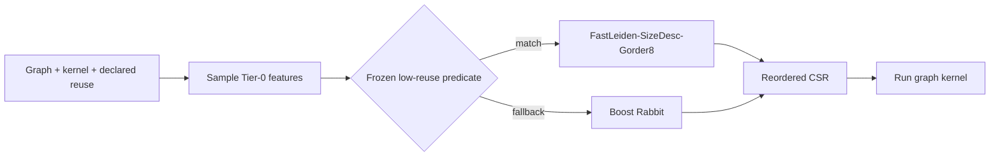
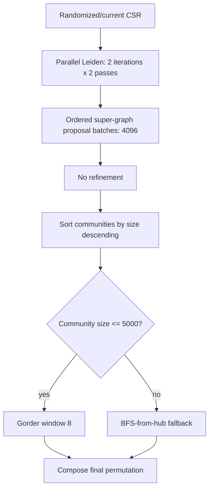

# All-Kernel Low-Reuse Selector

GraphBrew's final low-reuse contribution has two parts:

1. **FastLeiden-SizeDesc-Gorder8**, a cost-matched non-Rabbit composition.
2. **`allkernel-lowreuse-rule`**, a frozen feature rule that invokes that
   composition only where it beat Boost Rabbit during graph-held-out
   validation.

The composition is not a universal winner. The selector is essential.

## Result summary

The rule was derived from 18 graphs, frozen, and then evaluated on 12
additional graphs. It selected GraphBrew on seven holdouts and Boost Rabbit on
five.

| Reuse | Selected holdouts: Boost/GraphBrew | Lower 95% | Full 12-graph selector/always-Boost |
|---:|---:|---:|---:|
| 1 | 1.696x | 1.502x | 1.361x |
| 2 | 1.642x | 1.460x | 1.336x |

Every selected holdout graph won at both reuse counts.

## System overview



The selector does not use a graph filename, benchmark identity, or runtime
trial of multiple reorderers.

## The promoted composition

```text
12:leiden:compose:sg_none:comm_size_desc:intra_gorder:gw8:
cd_parallel:sgmb4096:gordf5000:norefine:2:2
```



### Why these pieces work

- **Two Leiden passes** recover multi-level community structure that the
  one-pass fast path lost.
- **Ordered proposal batches** evaluate modularity moves in parallel but
  commit each batch in community order. This removes most of the sequential
  super-graph bottleneck without using a whole-graph synchronous update, which
  lost locality quality.
- **No refinement** removes a costly phase whose low-reuse benefit did not
  amortize.
- **SizeDesc blocks** place large working regions contiguously and was the
  strongest block-order point effect in the controlled cost audit.
- **Gorder8** improves locality inside small/medium communities.
- **BFS fallback above 5000 vertices** prevents Gorder from dominating mapping
  time on large communities.

## Frozen selection rule

The candidate is selected only for the seven measured kernels, reuse at most
2, and:

```text
property_wsr_llc <= 3.2
and (
  (
    degree_cv <= 2.68
    and (avg_degree <= 60 or property_wsr_llc <= 0.82)
  )
  or degree_cv > 8
)
```

Otherwise GraphBrew uses Boost Rabbit. Builds without Boost use the reduced
fallback compiled into AdaptiveOrder.

### Interpretation

- **Property WSR/LLC** estimates whether the kernel's property working set is
  small enough for mapping savings and locality to matter.
- **Degree CV** separates moderate-skew community graphs, extreme-skew graphs,
  and the unstable middle region.
- **Average degree** prevents a low-skew but very dense graph from being
  selected unless its property working set is close to LLC.
- **Reuse** is explicit because Rabbit's faster steady-state kernel can
  overtake a cheaper mapping after repeated invocations.

## Figures


Circles are graphs selected by the frozen rule; crosses are Rabbit fallbacks.
Green means the candidate beats Boost Rabbit at reuse 1. The plotted
boundaries are projections of the full rule; average degree supplies the
remaining branch.


Fallback graphs remain at 1.0 because the selector executes Boost Rabbit.


The selected graphs generally win through both cheaper mapping and useful
kernel locality. A few graphs have slower candidate kernels but still win
reuse-1/2 end-to-end because mapping is much cheaper.

## How to run it

Reuse must be explicit:

```bash
# One invocation of the reordered graph
./bench/bin/pr -f graph.sg -s \
  -o '14:_:_:_:allkernel-lowreuse-rule:best-endtoend:1' -n 3

# Two invocations reusing the same materialized mapping
./bench/bin/bfs -f graph.sg -s \
  -o '14:_:_:_:allkernel-lowreuse-rule:best-endtoend:2' -n 3
```

`reuse=1` does not mean one PageRank iteration. One fixed-work PR invocation
still executes 20 internal iterations; reuse counts separate kernel
invocations that share one mapping.

## Reading the per-graph tables

- **Map C/B**: candidate mapping time divided by Boost mapping time. Below 1
  means GraphBrew maps faster.
- **Kernel B/C**: Boost kernel time divided by candidate kernel time. Above 1
  means GraphBrew's ordering runs the kernel faster.
- **Reuse B/C**: Boost end-to-end time divided by candidate end-to-end time.
  Above 1 means the candidate would win.
- A fallback row can show B/C above 1. That is deliberately unclaimed
  headroom left by the conservative frozen rule.

## Eleven-graph derivation matrix

| Graph | Rule choice | Why | Map C/B | Kernel B/C | Reuse 1 B/C | Reuse 2 B/C |
|---|---|---|---:|---:|---:|---:|
| Gong-gplus | Rabbit Boost | working set exceeds 3.2x LLC | 1.664 | 1.121 | 0.619 | 0.634 |
| USA-road-d.USA | Rabbit Boost | working set exceeds 3.2x LLC | 1.795 | 0.566 | 0.555 | 0.554 |
| cit-Patents | FastLeiden-Gorder8 | moderate skew and degree | 0.727 | 0.988 | 1.352 | 1.333 |
| com-Orkut | Rabbit Boost | intermediate/high skew outside frozen region | 1.192 | 1.099 | 0.848 | 0.856 |
| delaunay_n24 | Rabbit Boost | working set exceeds 3.2x LLC | 1.465 | 0.751 | 0.685 | 0.687 |
| hollywood-2009 | FastLeiden-Gorder8 | property working set near/below LLC | 0.524 | 0.996 | 1.821 | 1.758 |
| soc-LiveJournal1 | FastLeiden-Gorder8 | moderate skew and degree | 0.940 | 1.308 | 1.074 | 1.083 |
| soc-pokec | FastLeiden-Gorder8 | moderate skew and degree | 0.850 | 1.253 | 1.180 | 1.183 |
| twitter7 | Rabbit Boost | working set exceeds 3.2x LLC | 1.861 | 1.125 | 0.564 | 0.585 |
| webbase-2001 | Rabbit Boost | working set exceeds 3.2x LLC | 1.151 | 1.074 | 0.876 | 0.883 |
| wikipedia_link_en | Rabbit Boost | working set exceeds 3.2x LLC | 1.351 | 1.128 | 0.754 | 0.766 |

## Rule-correction graphs

The first rule failed on YouTube and Enron. Those outcomes were added to
training, the first rule was closed without editing its thresholds, and rule
version 2 was frozen before the final holdouts were opened.

| Graph | Rule-v2 choice | Why | Map C/B | Kernel B/C | Reuse 1 B/C | Reuse 2 B/C |
|---|---|---|---:|---:|---:|---:|
| as-Skitter | FastLeiden-Gorder8 | extreme degree skew | 0.793 | 1.106 | 1.247 | 1.236 |
| cit-HepPh | FastLeiden-Gorder8 | moderate skew and degree | 0.910 | 1.109 | 1.086 | 1.081 |
| com-Youtube | Rabbit Boost | intermediate/high skew outside frozen region | 1.232 | 1.105 | 0.823 | 0.832 |
| email-Enron | Rabbit Boost | intermediate/high skew outside frozen region | 0.975 | 0.974 | 0.990 | 0.974 |
| rgg_n_2_20_s0 | FastLeiden-Gorder8 | moderate skew and degree | 0.500 | 1.105 | 1.928 | 1.868 |
| roadNet-CA | FastLeiden-Gorder8 | moderate skew and degree | 0.790 | 0.734 | 1.224 | 1.190 |
| web-Google | FastLeiden-Gorder8 | moderate skew and degree | 0.601 | 0.945 | 1.596 | 1.543 |

## Twelve untouched rule-v2 holdouts

| Graph | Frozen choice | Why | Map C/B | Kernel B/C | Reuse 1 B/C | Reuse 2 B/C |
|---|---|---|---:|---:|---:|---:|
| amazon0601 | FastLeiden-Gorder8 | moderate skew and degree | 0.550 | 1.279 | 1.778 | 1.745 |
| cnr-2000 | FastLeiden-Gorder8 | moderate skew and degree | 0.656 | 1.016 | 1.447 | 1.396 |
| coPapersCiteseer | FastLeiden-Gorder8 | property working set near/below LLC | 0.462 | 1.119 | 2.049 | 1.969 |
| coPapersDBLP | FastLeiden-Gorder8 | moderate skew and degree | 0.477 | 1.219 | 2.018 | 1.961 |
| dblp-2010 | FastLeiden-Gorder8 | moderate skew and degree | 0.609 | 0.932 | 1.584 | 1.536 |
| in-2004 | FastLeiden-Gorder8 | extreme degree skew | 0.532 | 1.074 | 1.817 | 1.770 |
| kron_g500-logn18 | Rabbit Boost | intermediate/high skew outside frozen region | 0.743 | 0.650 | 1.188 | 1.104 |
| roadNet-TX | FastLeiden-Gorder8 | moderate skew and degree | 0.716 | 0.861 | 1.359 | 1.328 |
| soc-Slashdot0811 | Rabbit Boost | intermediate/high skew outside frozen region | 1.519 | 0.862 | 0.646 | 0.644 |
| web-BerkStan | Rabbit Boost | intermediate/high skew outside frozen region | 0.622 | 0.977 | 1.552 | 1.509 |
| wiki-Talk | Rabbit Boost | intermediate/high skew outside frozen region | 0.660 | 0.919 | 1.478 | 1.448 |
| wiki-topcats | Rabbit Boost | intermediate/high skew outside frozen region | 1.177 | 1.002 | 0.854 | 0.857 |

## Limitations

- The rule is validated only for reuse 1 and 2.
- Supported kernels are PR, PR-SpMV, BFS, CC, CC-SV, BC, and SSSP.
- CC-SV can regress even when the seven-kernel end-to-end aggregate wins.
- Boost Rabbit is the validated fallback.
- The rule is intentionally conservative and leaves some candidate wins on
  fallback graphs unclaimed.

## Evidence and implementation

- Public per-graph data:
  [`docs/allkernel-lowreuse-evidence.json`](https://github.com/UVA-LavaLab/GraphBrew/blob/main/docs/allkernel-lowreuse-evidence.json)
- Recommendation manifest:
  [`docs/recommendation-evidence.json`](https://github.com/UVA-LavaLab/GraphBrew/blob/main/docs/recommendation-evidence.json)
- Runtime selector:
  `bench/include/graphbrew/reorder/reorder_adaptive.h`
- GVE ordered batching:
  `bench/include/graphbrew/reorder/reorder_graphbrew.h`

