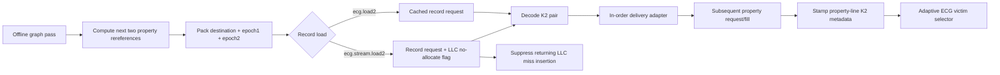
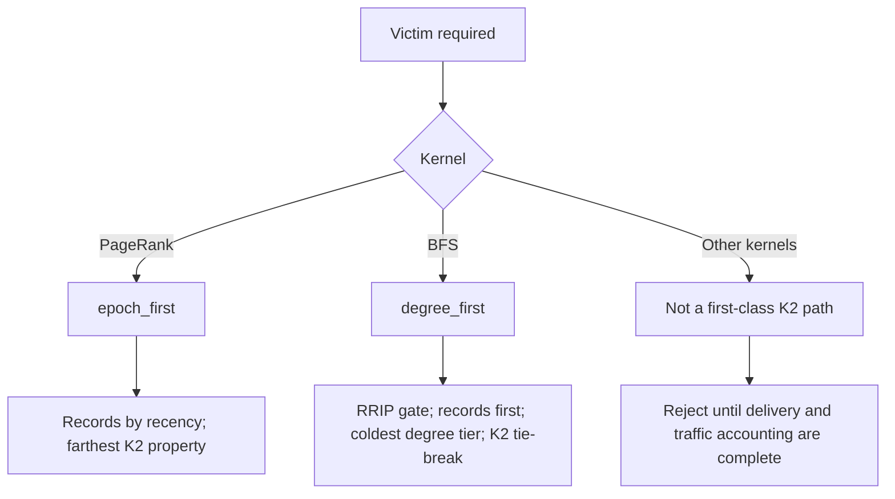
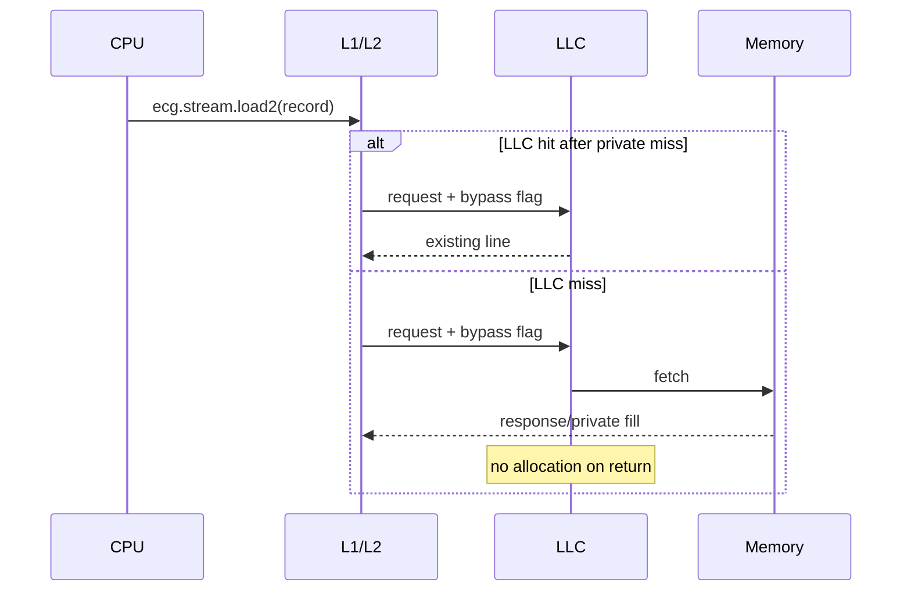
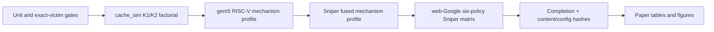

# ECG Successor HPCA Architecture

This is the only public paper-facing page for the ECG successor architecture.
The implementation remains under the `ECG_*` namespace while a distinct HPCA
paper name is selected.

## Scientific objective

Irregular graph kernels stream an edge record and then access a vertex property.
ECG uses that already-required record as an in-band channel for future-reuse and
cache-placement information.

The architecture aims to:

1. approach P-OPT-class future-reuse guidance without a live rereference matrix;
2. preserve GRASP's robust degree information for frontier traversals;
3. prevent one-touch record streams from polluting the shared LLC;
4. reserve zero LLC ways for ECG metadata;
5. expose placement through a request-bound instruction and reuse through an
   implementable record-load path.

## Architecture overview



### K2 record format

```text
63                    48 47                    32 31                     0
+-----------------------+-----------------------+------------------------+
|   epoch2 (16 bits)    |   epoch1 (16 bits)    |    destination (32)    |
+-----------------------+-----------------------+------------------------+
```

For `N_e` epochs, current epoch `c`, and delivered epoch `e`:

```text
d(e, c) = (e + N_e - (c mod N_e)) mod N_e
d_K2    = min(d(epoch1, c), d(epoch2, c))
```

The same `epochPairDistance` implementation is compiled into cache_sim, gem5,
and Sniper.

## Worked reuse example

Assume `N_e = 256` and current epoch `c = 10`.

| Line | K2 epochs | Effective distance |
|---|---|---:|
| A | `(12, 40)` | `min(2, 30) = 2` |
| B | `(20, 30)` | `min(10, 20) = 10` |
| C | `(11, 13)` | `min(1, 3) = 1` |

If the lines are otherwise tied, epoch-first eviction selects **B**, whose
nearest future use is farthest away.

## Adaptive replacement



Current first-class K2 claims cover PR and BFS. SSSP/BC/CC variants remain
research evidence until their pair delivery and packed-record traffic are
implemented consistently across the paper simulators.

GRASP-compatible insertion uses 3-bit RRPV:

| Graph class | Initial RRPV |
|---|---:|
| hot/high reuse | 1 |
| moderate reuse | 6 |
| cold/non-property/record | 7 |

## StreamShield placement

StreamShield keeps streamed records useful in the private caches without
allocating every miss in the shared LLC.



StreamShield preserves:

- private-cache fills;
- LLC tag lookup and LLC hits;
- memory ordering;
- derived stride-prefetch request semantics.

It suppresses only LLC allocation after a flagged miss.

## ISA

| Instruction | RISC-V custom-0 FUNCT3 | Meaning |
|---|---:|---|
| `ecg.load2 rd, 0(rs1)` | `0x4` | PR: load K2 record and deliver both epochs |
| `ecg.stream.load2 rd, 0(rs1)` | `0x3` | PR: same plus request-bound LLC no-allocation |

The full 64-bit record is returned in `rd`. The fused path avoids per-edge
SimMagic or a load/repack/extract instruction sequence.

StreamShield is request-bound. Current gem5 K2 delivery uses a serialized
in-order mailbox between the record load and subsequent property fill; a
request-bound pair extension is required before O3.

The current gem5 BFS equivalence path uses a normal packed 8-byte load followed
by `ecg.extract2`. It is mechanism-valid but is not a fused-load timing result.

## Comparison with prior policies

| Policy | Main decision signal | Extra structure | Reserved LLC ways | Placement |
|---|---|---|---:|---|
| LRU | recency | none | 0 | normal |
| SRRIP | generic rereference interval | per-line RRPV | 0 | normal |
| GRASP | degree/address hotness + RRIP | DBG hot/moderate ranges | 0 | normal |
| P-OPT | live next-reference distance | rereference matrix | charged | normal |
| ECG K2 | degree + RRIP + two edge-carried epochs | 8-byte edge record | 0 | normal |
| ECG K2+StreamShield | K2 plus one-touch placement | record + request bit | 0 | no-allocate miss |

Every reported comparison contains all six policies.

## Simulator mapping

| Component | cache_sim | gem5 | Sniper |
|---|---|---|---|
| K2 builder | shared | shared | shared |
| Victim decision | shared selector | shared selector | shared selector |
| Metadata delivery | instrumented record load | PR fused load2; BFS packed load + `ecg.extract2`; in-order pair mailbox | fused sideband model |
| StreamShield | preserve LLC hits, suppress miss insertion | clear LLC `allocOnFill` | preserve NUCA hits, suppress miss insertion |
| Paper role | functional authority | cycle-accurate ISA proof | real-graph scale/timing |

Absolute gem5 and Sniper miss rates are not compared because their cache
inclusion, frontend, and accounting models differ. Direction relative to each
simulator's LRU is the cross-simulator evidence.

## Evaluation flow



Canonical profiles:

| Profile | Purpose |
|---|---|
| `ecg_smoke` | Fast six-policy cache_sim check |
| `ecg_cache_sim_factorial` | K1/K2 x StreamShield attribution on real graphs |
| `gem5_streamshield_mechanism` | Request-bound RISC-V mechanism cell |
| `sniper_streamshield_mechanism` | Fused K2/StreamShield mechanism cell |
| `streamshield_sniper_realgraph` | Bounded web-Google paper matrix |

## Current evidence

- The historical cache_sim attribution was **K2 77.3%**, **StreamShield 22.7%**,
  but used full LLC lookup bypass. It is retained as provenance and must be
  rerun under the current tag-hit-preserving StreamShield semantics.
- gem5 mechanism cell: StreamShield improves fused K2 by **13.03%** and cuts
  K2 L3 misses by **58.24%**.
- Sniper mechanism cell: StreamShield improves fused K2 by **0.65%** with the
  same instruction count.
- K2 PR/BFS and StreamShield PR exact mechanism gates pass across all three
  simulators.

These synthetic cells validate the mechanism; they do not rank the policies.
Overall detailed-simulator superiority over P-OPT remains pending the complete
real-graph Sniper matrix.

## Hardware accounting

- 8-byte K2 edge record.
- Zero ECG-reserved LLC ways.
- One request-bound StreamShield bit.
- Two 16-bit epochs plus valid/count state per governed line.
- Charged P-OPT matrix capacity in every reported baseline.
- Request-bound K2 pair propagation remains required before gem5 O3 evaluation.
- No hidden matrix, zero-latency bypass, or aggressive per-access LLC metadata
  broadcast in headline rows.

## Reproduce

```bash
python3 scripts/experiments/ecg/flows/paper_run.py \
  --profile ecg_smoke \
  --run-dir results/ecg_experiments/final_paper_runs/ecg_smoke

python3 scripts/experiments/ecg/flows/paper_run.py \
  --profile streamshield_sniper_realgraph \
  --run-dir results/ecg_experiments/final_paper_runs/ecg_successor_webgoogle \
  --no-build
```

Full graph staging, mechanism profiles, Slurm, and aggregation commands are in
`research/ecg-hpca/RUNBOOK.md`.

## Prior-publication boundary

The preliminary *ECG: Expressing Locality and Prefetching for Optimal Caching
in Graph Structures* paper is an archival IEEE IPDPSW 2024 publication
(pp. 520–525, DOI `10.1109/IPDPSW59749.2024.00094`).

An HPCA submission must be materially distinct, cite and disclose the workshop
paper, include the contribution delta, and receive PC-chair guidance before
registration. Renaming alone does not establish eligibility.

## Artifact links

- [Paper SSOT](https://github.com/UVA-LavaLab/GraphBrew/tree/graphbrew_ecg/research/ecg-hpca)
- [Architecture SSOT](https://github.com/UVA-LavaLab/GraphBrew/blob/graphbrew_ecg/research/ecg-hpca/ARCHITECTURE.md)
- [Manifest](https://github.com/UVA-LavaLab/GraphBrew/blob/graphbrew_ecg/scripts/experiments/ecg/final_paper_manifest.json)
- [Runner](https://github.com/UVA-LavaLab/GraphBrew/blob/graphbrew_ecg/scripts/experiments/ecg/flows/paper_run.py)
- [Matrix engine](https://github.com/UVA-LavaLab/GraphBrew/blob/graphbrew_ecg/scripts/experiments/ecg/roi_matrix.py)
