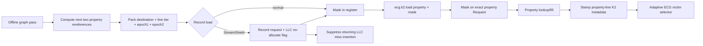
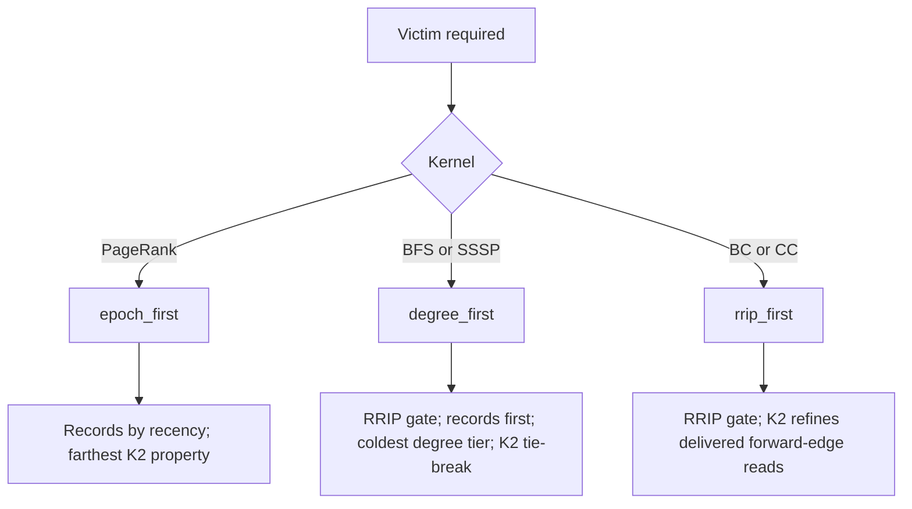
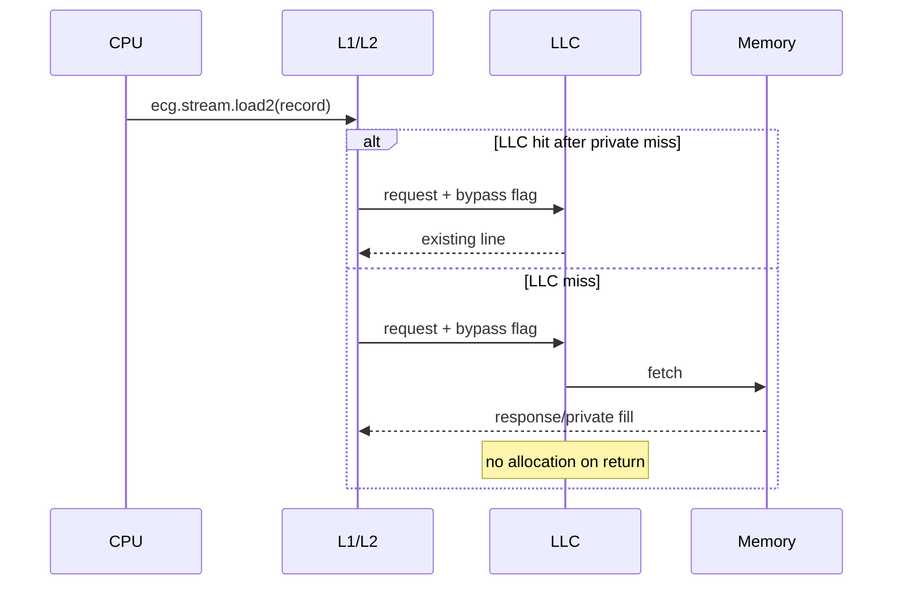
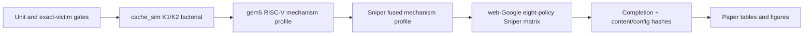

# ECG Successor HPCA Architecture

This is the only public paper-facing page for the ECG successor architecture.
The implementation remains under the `ECG_*` namespace while a distinct HPCA
paper name is selected.

## Scientific objective

Irregular graph kernels stream an edge record and then access a vertex property.
ECG uses that already-required record as an in-band channel for future-reuse and
cache-placement information.

The architecture aims to:

1. approach P-OPT-class future-reuse guidance without a live rereference matrix;
2. preserve GRASP's robust degree information for frontier traversals;
3. prevent one-touch record streams from polluting the shared LLC;
4. reserve zero LLC ways for ECG metadata;
5. expose placement through a request-bound instruction and reuse through an
   implementable record-load path.

## Architecture overview


```mermaid
flowchart LR
    A[Offline graph pass] --> B[Compute next two property rereferences]
    B --> C[Pack destination + line tier + epoch1 + epoch2]
    C --> D{Record load}
    D -->|normal| E[Mask in register]
    D -->|StreamShield| F[Record request + LLC no-allocate flag]
    F --> E
    E --> G[ecg.k2.load property + mask]
    G --> H[Mask on exact property Request]
    H --> I[Property lookup/fill]
    I --> J[Stamp property-line K2 metadata]
    J --> K[Adaptive ECG victim selector]
    F --> L[Suppress returning LLC miss insertion]
```

## Final design

```text
ECG:K2_ONLINE_STREAMSHIELD
= K2 record + online replacement + static generic StreamShield
```

Adaptive allocate-vs-shield placement is retained only as a default-off
ablation: static StreamShield wins all 15 tested graph/kernel placement cells.

### K2 record format

```text
63                 49 48                 34 33   32 31                  0
+---------------------+---------------------+-------+---------------------+
| epoch2 (15 bits)    | epoch1 (15 bits)    | tier  | destination (32)    |
+---------------------+---------------------+-------+---------------------+
```

The 2-bit tier is `hot/moderate/cold`. It is computed from direction-aware
property-reader counts and aggregated as the hottest tier sharing the property
line (15% hot and 15% moderate by default), so it remains valid without DBG
layout. The 15-bit epoch fields support
up to 32,768 circular epochs.

For `N_e` epochs, current epoch `c`, and delivered epoch `e`:

```text
d(e, c) = (e + N_e - (c mod N_e)) mod N_e
d_K2    = min(d(epoch1, c), d(epoch2, c))
```

The same `epochPairDistance` implementation is compiled into cache_sim, gem5,
and Sniper.

## Worked reuse example

Assume `N_e = 256` and current epoch `c = 10`.

| Line | K2 epochs | Effective distance |
|---|---|---:|
| A | `(12, 40)` | `min(2, 30) = 2` |
| B | `(20, 30)` | `min(10, 20) = 10` |
| C | `(11, 13)` | `min(1, 3) = 1` |

If the lines are otherwise tied, epoch-first eviction selects **B**, whose
nearest future use is farthest away.

## Method guide

| Method | Decision | Small example | Paper role |
|---|---|---|---|
| LRU | oldest access | A last used before B → evict A | recency baseline |
| SRRIP | largest RRPV | A=7, B=3 → evict A | generic predictor |
| GRASP | degree tier + RRIP | hot vertex inserts at RRPV 1; cold at 7 | graph baseline |
| P-OPT | matrix next reference | A next=4, B next=20 → evict B | charged practical oracle |
| K1 | one carried epoch | A distance 4, B distance 20 → evict B | single-hint ablation |
| K2 static | nearer of two epochs | B `(20,30)` is farther than A `(12,40)` | two-hint mechanism |
| K2 online | five replacement leaders | degree arm has fewest sampled misses → followers use degree | final replacement |
| K2 online+SS | online K2 + record no-allocate | record misses LLC → fill L1/L2, skip LLC fill | **final design** |
| Adaptive SS | allocate vs shield leaders | shield has fewer misses → followers shield | default-off ablation |

## Static and online replacement


```mermaid
flowchart TD
    A[Victim required] --> B{Kernel}
    B -->|PageRank| C[epoch_first]
    B -->|BFS or SSSP| D[degree_first]
    B -->|BC or CC| E[rrip_first]
    C --> F[Records by recency; farthest K2 property]
    D --> G[RRIP gate; records first; coldest degree tier; K2 tie-break]
    E --> H[RRIP gate; K2 refines delivered forward-edge reads]
```

First-class K2 construction, pair delivery, and victim checks cover
PR/BFS/SSSP/BC/CC across cache_sim, gem5, and Sniper. BC carries K2 on its
forward Brandes edge traversal; its runtime successor-DAG backward phase has no
static record position. CC remains scoped to undirected/symmetric graphs.

`ECG:K2_ONLINE` instead assigns one leader set per arm in each 64-set group:
RRIP-first, GRASP-only, epoch-first, degree-first, and LRU-only. Followers use
the lowest-miss arm, with counters reset every 1024 sampled leader misses. This
selection is live in cache_sim, gem5, and Sniper and does not inspect the graph
or algorithm name.

GRASP-compatible insertion uses 3-bit RRPV:

| Graph class | Initial RRPV |
|---|---:|
| hot/high reuse | 1 |
| moderate reuse | 6 |
| cold/non-property/record | 7 |

## StreamShield placement

StreamShield keeps streamed records useful in the private caches without
allocating every miss in the shared LLC.


```mermaid
sequenceDiagram
    participant CPU
    participant L1L2 as L1/L2
    participant LLC
    participant MEM as Memory
    CPU->>L1L2: ecg.stream.load2(record)
    alt LLC hit after private miss
        L1L2->>LLC: request + bypass flag
        LLC-->>L1L2: existing line
    else LLC miss
        L1L2->>LLC: request + bypass flag
        LLC->>MEM: fetch
        MEM-->>L1L2: response/private fill
        Note over LLC: no allocation on return
    end
```

StreamShield preserves:

- private-cache fills;
- LLC tag lookup and LLC hits;
- memory ordering;
- derived stride-prefetch request semantics.

It suppresses only LLC allocation after a flagged miss.

## ISA

| Instruction | RISC-V custom-0 encoding | Meaning |
|---|---:|---|
| `ecg.k2.load rd, rs1, rs2` | FUNCT3 `0x2`, mode `0x03` | load the governed property and carry tier plus both epochs on that exact request |
| `ecg.stream.load2 rd, 0(rs1)` | FUNCT3 `0x3` | optional StreamShield load for an unweighted K2 record |
| `ecg.stream.wload2 rd, rs1, rs2` | FUNCT3 `0x5` | optional StreamShield load for the weighted 4-byte sidecar |

The graph stream supplies the mask. The property-load instruction carries that
mask as request metadata, so the cache knows the policy before the property data
returns. Weighted SSSP combines its destination and 32-bit sidecar into the same
canonical 64-bit K2 register layout.

StreamShield is independently request-bound to the record/sidecar load. All five
gem5 kernels use the masked K2 property load. Tiny PR and weighted SSSP O3 runs
prove that the pair reaches the correct property request; Sniper uses the
equivalent fused sideband immediately before the property access.

## Comparison with prior policies

| Policy | Main decision signal | Extra structure | Reserved LLC ways | Placement |
|---|---|---|---:|---|
| LRU | recency | none | 0 | normal |
| SRRIP | generic rereference interval | per-line RRPV | 0 | normal |
| GRASP | degree/address hotness + RRIP | DBG hot/moderate ranges | 0 | normal |
| P-OPT | live next-reference distance | rereference matrix | charged | normal |
| ECG K2 | degree + RRIP + two edge-carried epochs | 8-byte edge record | 0 | normal |
| ECG K2 online | five-arm sampled victim selection | same record + counters | 0 | normal |
| ECG K2+StreamShield | K2 plus one-touch placement | record + request bit | 0 | no-allocate miss |

The headline matrix contains all four baselines plus static/online K2 with and
without StreamShield.

## Simulator mapping

| Component | cache_sim | gem5 | Sniper |
|---|---|---|---|
| K2 builder | shared | shared | shared |
| Victim decision | shared selector | shared selector | shared selector |
| Metadata delivery | masked property access | all five request-bound masked property loads | fused record sideband before property access |
| StreamShield | preserve LLC hits, suppress miss insertion | clear LLC `allocOnFill` | preserve NUCA hits, suppress miss insertion |
| Paper role | functional authority | cycle-accurate ISA proof | real-graph scale/timing |

Absolute gem5 and Sniper miss rates are not compared because their cache
inclusion, frontend, and accounting models differ. Direction relative to each
simulator's LRU is the cross-simulator evidence.
Canonical all-kernel Schedule-2 rows use fused delivery. Historical explicit
`extract2` rows remain cache-behavior evidence only.

## Evaluation flow


```mermaid
flowchart LR
    A[Unit and exact-victim gates] --> B[cache_sim K1/K2 factorial]
    B --> C[gem5 RISC-V mechanism profile]
    C --> D[Sniper fused mechanism profile]
    D --> E[web-Google eight-policy Sniper matrix]
    E --> F[Completion + content/config hashes]
    F --> G[Paper tables and figures]
```

Canonical profiles:

| Profile | Purpose |
|---|---|
| `ecg_smoke` | Fast cache_sim check including online K2 |
| `ecg_3sim_allalg_smoke` | 3 simulators x 5 algorithms x 8 final policies |
| `ecg_3sim_realgraph_allalg` | 3 simulators x 3 real graphs x 5 algorithms x 8 policies |
| `ecg_3sim_realgraph_allalg_1b` | Full cache_sim plus 1B-instruction detailed-simulator diagnostic |
| `ecg_3sim_sampled_allalg` | Full-work matrix on deterministic real-graph samples |
| `ecg_sniper_sampled_pr_streamengine` | Equal-work sampled PR timing for fused K2 bandwidth |
| `ecg_sniper_realgraph_warm_probe` | Full web-Google warm-SIFT LRU/K2 100K gate |
| `ecg_sniper_realgraph_600m` | DROPLET-style 600M-capped full-graph plan |
| `ecg_replacement_baseline` | Equal-capacity static-arm and online-regret study |
| `ecg_online_dueling` | Alias for the online-regret stage |
| `ecg_cache_sim_factorial` | K1/K2 x StreamShield attribution on real graphs |
| `ecg_streamshield_generality` | All-kernel allocate-vs-shield comparison |
| `gem5_streamshield_mechanism` | Request-bound RISC-V mechanism cell |
| `sniper_streamshield_mechanism` | Fused K2/StreamShield mechanism cell |
| `streamshield_sniper_realgraph` | Pending-calibration full-iteration web-Google matrix |

## Current evidence

- The historical **77.3% / 22.7%** lookup-bypass attribution is provenance only.
  The corrected K1-relative split is **K2+online 83.94% / StreamShield 16.06%**.
- gem5 mechanism cell: StreamShield improves fused K2 by **13.03%** and cuts
  K2 L3 misses by **58.24%**.
- Sniper mechanism cell: StreamShield improves fused K2 by **0.65%** with the
  same instruction count.
- K2 and static StreamShield exact mechanism gates pass for
  PR/BFS/SSSP/BC/CC across all three simulators.
- The complete cache_sim real-graph replacement profile exercises all five K2
  arms: online K2 is within 0.26% geomean LLC misses of the per-cell best
  static arm and beats it on 8/15 cells.
- Relative to K1, the corrected tag-hit-preserving factorial attributes
  weighted avoided demand misses as **K2+online 83.94% / StreamShield 16.06%**.
  StreamShield reduces online-K2 traffic by 3.23%, but full ECG still uses
  5.28% more traffic than charged P-OPT.
- A separate two-arm placement duel now selects LLC allocation versus
  StreamShield; the five-kernel three-simulator mechanism gate passes, while
  the all-kernel matrix shows 0.95% geomean regret versus static StreamShield.
  It remains a default-off ablation.
- The 360-row sampled full-work matrix passes its strict gate. SRRIP and GRASP
  show strong cross-backend agreement, but K2's fixed record cost dominates at
  this scale and all K2 variants increase geomean misses versus LRU. These rows
  are bounded backend diagnostics, not headline K2 performance evidence.
- The earlier nine-row sampled PageRank profile remains an attribution
  diagnostic; its pre-surgical timing is superseded by the current all-kernel
  matrix.
- The corrected 120-row sampled Sniper all-kernel matrix passes. Final
  K2-online+StreamShield reaches 1.790x on PR, 1.667x on BFS, 1.074x on BC,
  and 1.120x on CC versus LRU. Weighted SSSP is near neutral at 0.966x. Overall
  sampled geomean is 1.282x versus LRU, ahead of GRASP's 1.100x; static
  K2+StreamShield reaches 1.288x. Excluding the shortest BFS cell still leaves
  K2-online+StreamShield at 1.229x versus GRASP at 1.108x.
- The bounded matched-STRIDE diagnostic rejects Sniper's current generic simple
  prefetcher: every policy overprefetches, and K2 LLC read traffic rises
  93x--596x. Sniper demand misses are not inferred because NUCA statistics do
  not split demand from prefetch misses.

Synthetic cells validate delivery and request behavior only. Real-graph
cache_sim rows provide replacement/placement authority; final timing claims
remain pending the complete Sniper matrix and a bounded prefetch configuration.

## Hardware accounting

- 8-byte K2 edge record for unweighted kernels.
- Weighted SSSP uses its existing 8-byte edge plus a 4-byte K2 sidecar.
- Zero ECG-reserved LLC ways.
- One request-bound StreamShield bit.
- Two 15-bit epochs, a 2-bit carried tier, and valid/count state per governed line.
- Charged P-OPT matrix capacity in every reported baseline.
- Request-bound K2 pair propagation is implemented; gem5 O3 is limited to tiny
  instruction-correctness cells.
- No hidden matrix, zero-latency bypass, or aggressive per-access LLC metadata
  broadcast in headline rows.

## Reproduce

### Full 3-simulator smoke

This is the final data-shape gate:

```text
3 simulators x 5 algorithms x 8 policies = 120 rows
```

```bash
python3 scripts/experiments/ecg/slurm/make_slurm_shards.py \
  --profile ecg_3sim_allalg_smoke \
  --run-tag ecg_3sim_smoke \
  --out results/ecg_experiments/slurm/ecg_3sim_smoke.tsv

python3 scripts/experiments/ecg/flows/run_local_shards.py \
  --shards results/ecg_experiments/slurm/ecg_3sim_smoke.tsv \
  --run-root results/ecg_experiments/final_paper_runs/local \
  --jobs 8 --cache-sim-jobs 5 --gem5-jobs 1 --sniper-jobs 1

python3 scripts/experiments/ecg/flows/paper_pipeline.py \
  --skip-run \
  --input-run-glob \
    "results/ecg_experiments/final_paper_runs/local/ecg_3sim_smoke/*" \
  --run-root results/ecg_experiments/paper_pipeline/ecg_3sim_smoke

python3 scripts/experiments/ecg/verify/smoke_coverage.py \
  --csv results/ecg_experiments/paper_pipeline/ecg_3sim_smoke/aggregate/roi_matrix_all.csv
```

Expected coverage:

| Backend | Required data |
|---|---|
| all | status, policy, L3 misses/rate, timing-valid flag, exercised L3 |
| cache_sim | property misses/hits and total memory traffic |
| gem5 | L3 accesses, DRAM read/write bytes, ticks, IPC, load2/stream.load2 mode |
| Sniper | L3 accesses, instructions, ticks, IPC, CPI components, fused receipts |

On a larger host, increase `--gem5-jobs` and `--sniper-jobs`; each shard has
isolated sidebands and locks.

### Three-real-graph cross-simulator matrix

The real-graph comparison expands to 360 rows:

```text
3 simulators x 3 graphs x 5 algorithms x 8 policies
```

Use profile `ecg_3sim_realgraph_allalg` with the shard flow above. The graphs
are web-Google, soc-pokec, and cit-Patents; prefetching is disabled so the
comparison isolates replacement and StreamShield.

```bash
python3 scripts/experiments/ecg/slurm/make_slurm_shards.py \
  --profile ecg_3sim_realgraph_allalg \
  --run-tag ecg_3sim_realgraph_allalg \
  --out results/ecg_experiments/slurm/ecg_3sim_realgraph_allalg.tsv

python3 scripts/experiments/ecg/flows/run_local_shards.py \
  --shards results/ecg_experiments/slurm/ecg_3sim_realgraph_allalg.tsv \
  --run-root results/ecg_experiments/final_paper_runs/local \
  --jobs 9 --cache-sim-jobs 4 --gem5-jobs 4 --sniper-jobs 1
```

Calibrate Sniper LRU/PR on all three graphs before the full launch. Per-shard
sidebands make bounded gem5 parallelism safe; Sniper remains serialized under
its 20-GiB cap. Interpret `roi_relative_metrics.csv` within each simulator
relative to LRU; absolute cache_sim, gem5, and Sniper miss rates are not
directly comparable. BC K2 covers the forward Brandes traversal; CC retains
the undirected/symmetric graph contract.

For faster diagnostic results, profile `ecg_3sim_realgraph_allalg_1b` keeps
cache_sim at full workload completion and caps gem5/Sniper at one billion
committed detailed-ROI instructions. Gem5 starts its budget at the compute
work-begin marker. These rows are not speedup or equal-graph-work evidence.

Profile `ecg_3sim_sampled_allalg` instead runs all three simulators to semantic
completion on deterministic compact samples of web-Google, soc-pokec, and
cit-Patents. It preserves all five algorithms and eight final policies and is
the fast cross-simulator comparison; full-graph cache_sim remains the authority.
The Pokec sample has a larger LLC-per-vertex ratio than the full graph, so its
sampled cache pressure is lower. Cit-Patents is symmetrized after sampling.

Profile `ecg_sniper_realgraph_600m` is the paper-faithful full-graph detailed
path: explicit SIFT execution, graph loading outside the detailed region, and a
600M-instruction cap. This follows DROPLET's bounded ROI precedent; GRASP and
P-OPT similarly simulated representative iterations rather than full detailed
execution. Because K2 changes the instruction stream, these capped rows support
cache/direction claims rather than speedup; sampled full-completion rows provide
the equal-work timing comparison. The strict smoke gate validates fused
transport separately so the 600M profile retains Sniper's normal cache warming.
The warm queue blocker is resolved: full web-Google LRU and K2 both complete a
100K detailed ROI with cache warming enabled. CACHE_ONLY warming updates cache
state without accumulating queue/shared-memory timing. The first post-fix
web-Google K2 capped cell also completes successfully, finishing its full PR
iteration at 179.4M reported instructions before the 600M cap.

### Other profiles

```bash
python3 scripts/experiments/ecg/flows/paper_run.py \
  --profile ecg_smoke \
  --run-dir results/ecg_experiments/final_paper_runs/ecg_smoke

python3 scripts/experiments/ecg/flows/paper_run.py \
  --profile ecg_replacement_baseline \
  --run-dir results/ecg_experiments/final_paper_runs/ecg_replacement \
  --no-build

python3 scripts/experiments/ecg/flows/paper_run.py \
  --profile ecg_cache_sim_factorial \
  --run-dir results/ecg_experiments/final_paper_runs/ecg_factorial \
  --no-build

python3 scripts/experiments/ecg/flows/paper_pipeline.py \
  --skip-run \
  --input-run-dirs \
    results/ecg_experiments/final_paper_runs/ecg_replacement \
    results/ecg_experiments/final_paper_runs/ecg_factorial \
  --run-root results/ecg_experiments/paper_pipeline/ecg_final

python3 scripts/experiments/ecg/flows/paper_run.py \
  --profile streamshield_sniper_realgraph \
  --run-dir results/ecg_experiments/final_paper_runs/ecg_successor_webgoogle \
  --list --dry-run --no-build
```

Independent matrix cells can run concurrently:

```bash
python3 scripts/experiments/ecg/slurm/make_slurm_shards.py \
  --profile ecg_streamshield_generality \
  --run-tag ecg_parallel \
  --out results/ecg_experiments/slurm/ecg_parallel.tsv

python3 scripts/experiments/ecg/flows/run_local_shards.py \
  --shards results/ecg_experiments/slurm/ecg_parallel.tsv \
  --jobs 8 --cache-sim-jobs 8 --gem5-jobs 1 --sniper-jobs 1
```

Full graph staging, mechanism profiles, Slurm, and aggregation commands are in
`research/ecg-hpca/RUNBOOK.md`.

## Prior-publication boundary

The preliminary *ECG: Expressing Locality and Prefetching for Optimal Caching
in Graph Structures* paper is an archival IEEE IPDPSW 2024 publication
(pp. 520–525, DOI `10.1109/IPDPSW59749.2024.00094`).

An HPCA submission must be materially distinct, cite and disclose the workshop
paper, include the contribution delta, and receive PC-chair guidance before
registration. Renaming alone does not establish eligibility.

## Artifact links

- [Paper SSOT](https://github.com/UVA-LavaLab/GraphBrew/tree/graphbrew_ecg/research/ecg-hpca)
- [Architecture SSOT](https://github.com/UVA-LavaLab/GraphBrew/blob/graphbrew_ecg/research/ecg-hpca/ARCHITECTURE.md)
- [Manifest](https://github.com/UVA-LavaLab/GraphBrew/blob/graphbrew_ecg/scripts/experiments/ecg/final_paper_manifest.json)
- [Runner](https://github.com/UVA-LavaLab/GraphBrew/blob/graphbrew_ecg/scripts/experiments/ecg/flows/paper_run.py)
- [Matrix engine](https://github.com/UVA-LavaLab/GraphBrew/blob/graphbrew_ecg/scripts/experiments/ecg/roi_matrix.py)
