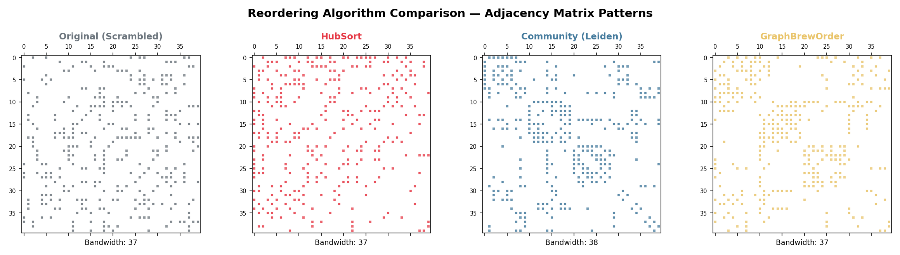
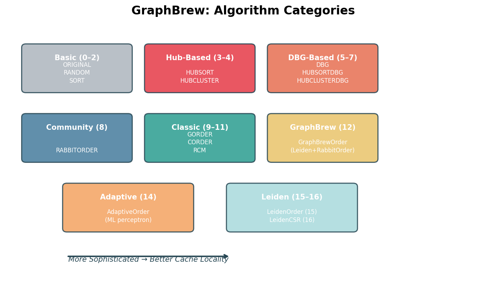
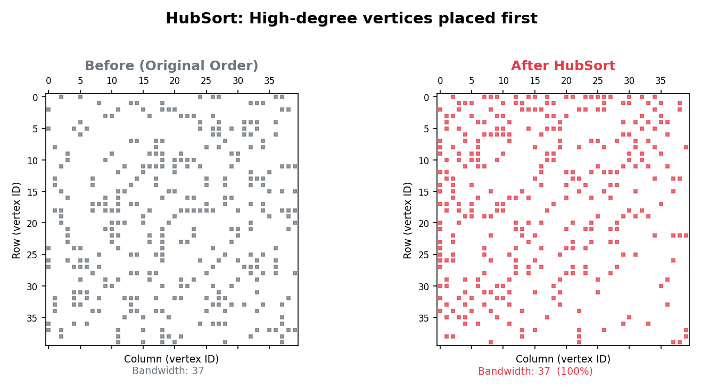
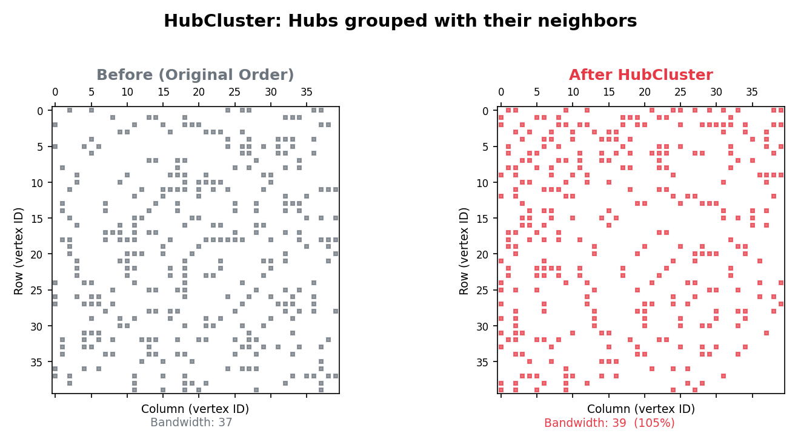
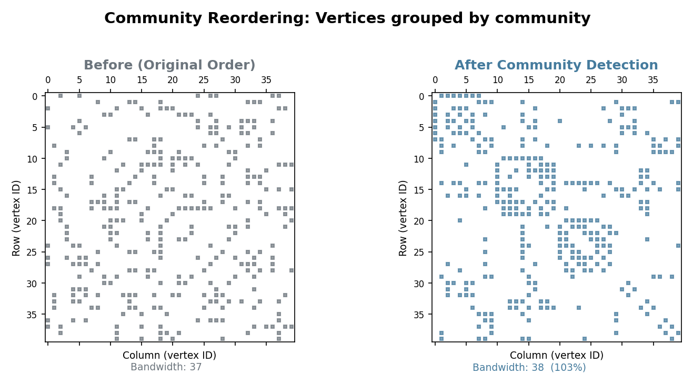
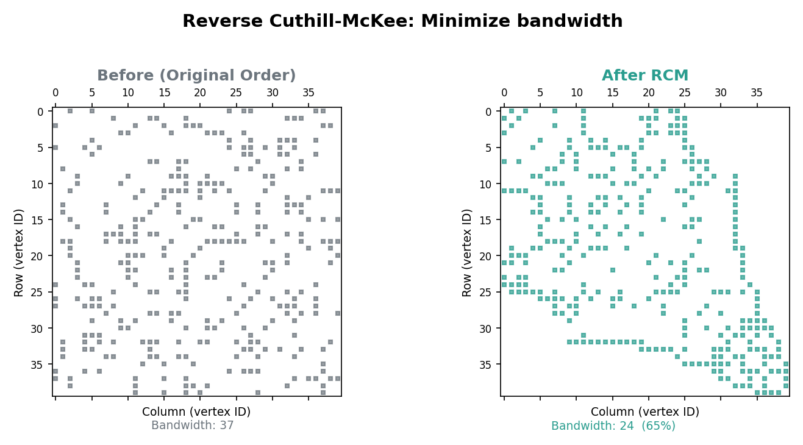
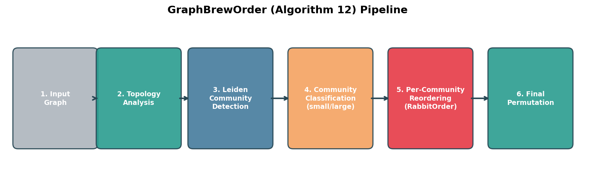
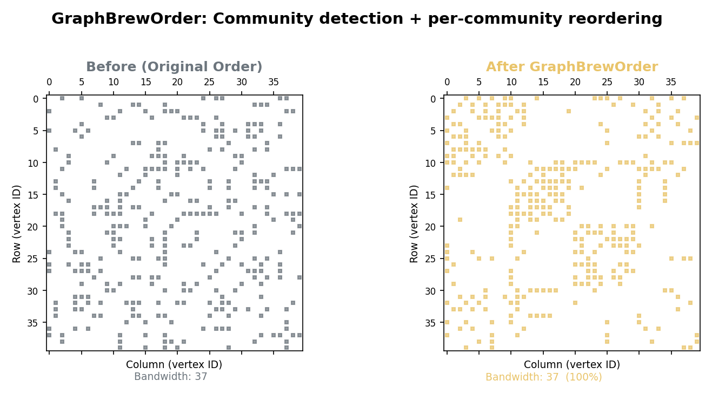
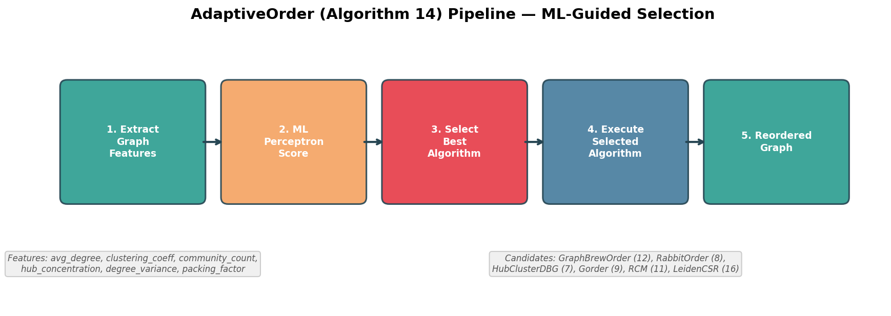

# Graph Reordering Algorithms

GraphBrew implements **16 different vertex reordering algorithms** (IDs 0-15), each with unique characteristics suited for different graph topologies. This page explains each algorithm in detail.

Note: Algorithm ID 13 (MAP) is reserved for external label mapping files, not a standalone reordering algorithm.

## Why Reorder Graphs?

Graph algorithms spend significant time accessing memory. When vertices are ordered randomly, memory access patterns are unpredictable, causing **cache misses**. Reordering places frequently co-accessed vertices together in memory, dramatically improving cache utilization.

```
Before Reordering:           After Reordering:
Vertex 1 → 5, 99, 2000       Vertex 1 → 2, 3, 4
Vertex 2 → 8, 1500, 3        Vertex 2 → 1, 3, 5
(scattered neighbors)         (nearby neighbors)
```

The effect is visible when plotting the adjacency matrix — a well-ordered graph has non-zero entries clustered near the diagonal, while a poorly-ordered graph has them scattered:



## Algorithm Categories



| Category | Algorithms | Best For |
|----------|------------|----------|
| **Basic** | ORIGINAL, RANDOM, SORT | Baseline comparisons |
| **Hub-Based** | HUBSORT, HUBCLUSTER | Power-law graphs |
| **DBG-Based** | DBG, HUBSORTDBG, HUBCLUSTERDBG | Cache locality |
| **Community** | RABBITORDER | Hierarchical communities |
| **Classic** | GORDER, CORDER, RCM | Bandwidth reduction |
| **Leiden-Based** | LeidenOrder (15, baseline) | Strong community structure |
| **Hybrid** | GraphBrewOrder (12), MAP (13), AdaptiveOrder (14) | External/Adaptive selection |

---

## Basic Algorithms (0-2)

### 0. ORIGINAL
**Keep original vertex ordering**

```bash
./bench/bin/pr -f graph.el -s -o 0 -n 3
```

- **Description**: Uses vertices in their original order from the input file
- **Complexity**: O(1) - no reordering
- **Best for**: Baseline comparison, already well-ordered graphs
- **When to use**: Always run this first to establish baseline performance

### 1. RANDOM
**Random vertex permutation**

```bash
./bench/bin/pr -f graph.el -s -o 1 -n 3
```

- **Description**: Randomly shuffles all vertices
- **Complexity**: O(n) where n = number of vertices
- **Best for**: Testing, worst-case scenarios
- **When to use**: Debugging, establishing worst-case baseline

### 2. SORT
**Sort vertices by ID**

```bash
./bench/bin/pr -f graph.el -s -o 2 -n 3
```

- **Description**: Sorts vertices in ascending order by original ID
- **Complexity**: O(n log n)
- **Best for**: Graphs where IDs have locality meaning
- **When to use**: When input has meaningful vertex numbering

---

## Hub-Based Algorithms (3-4)

These algorithms prioritize **high-degree vertices (hubs)** which are accessed frequently.

### 3. HUBSORT
**Sort by degree (hubs first)**

```bash
./bench/bin/pr -f graph.el -s -o 3 -n 3
```

- **Description**: Places high-degree vertices (hubs) at the beginning
- **Complexity**: O(n log n)
- **Rationale**: Hubs are accessed most frequently; placing them together improves cache reuse
- **Best for**: Power-law graphs (social networks, web graphs)

**How it works:**
```
Original:  v1(deg=5), v2(deg=100), v3(deg=2), v4(deg=50)
After:     v2(deg=100), v4(deg=50), v1(deg=5), v3(deg=2)
```



### 4. HUBCLUSTER
**Cluster hubs with their neighbors**

```bash
./bench/bin/pr -f graph.el -s -o 4 -n 3
```

- **Description**: Places each hub followed by its neighbors
- **Complexity**: O(n + m) where m = number of edges
- **Rationale**: When accessing a hub, its neighbors are likely accessed next
- **Best for**: Graphs with hub-and-spoke patterns

**How it works:**
```
Hub v2 has neighbors: v1, v5, v8
Ordering: v2, v1, v5, v8, [next hub], ...
```



---

## DBG-Based Algorithms (5-7)

**Degree-Based Grouping (DBG)** creates "frequency zones" based on access patterns.

### 5. DBG
**Degree-Based Grouping**

```bash
./bench/bin/pr -f graph.el -s -o 5 -n 3
```

- **Description**: Groups vertices by degree into logarithmic buckets
- **Complexity**: O(n)
- **Rationale**: Vertices with similar degrees have similar access frequencies
- **Best for**: General-purpose, works well on most graphs

**Bucket structure:**
```
Bucket 0: degree 1
Bucket 1: degree 2-3
Bucket 2: degree 4-7
Bucket 3: degree 8-15
...
```

### 6. HUBSORTDBG
**HUBSORT within DBG buckets**

```bash
./bench/bin/pr -f graph.el -s -o 6 -n 3
```

- **Description**: First groups by DBG, then sorts each bucket by degree
- **Complexity**: O(n log n)
- **Best for**: Combines benefits of both approaches

### 7. HUBCLUSTERDBG ⭐ (Recommended for power-law)
**HUBCLUSTER within DBG buckets**

```bash
./bench/bin/pr -f graph.el -s -o 7 -n 3
```

- **Description**: First groups by DBG, then clusters hubs with neighbors in each bucket
- **Complexity**: O(n + m)
- **Best for**: Power-law graphs with clear hub structure

### Edge Case Handling (Hub-Based Algorithms)

All hub-based algorithms (HUBSORT, HUBCLUSTER, DBG, HUBSORTDBG, HUBCLUSTERDBG) include guards for empty subgraphs:

```cpp
// Guard against empty graphs (prevents division by zero)
if (num_nodes == 0) {
    return;  // Nothing to reorder
}
const int64_t avgDegree = num_edges / num_nodes;
```

This is important when these algorithms are used as the **final algorithm** in GraphBrewOrder, where community subgraphs may have no internal edges on graphs with extreme structure (e.g., Kronecker graphs).

---

## Community & Classic Algorithms (8-11)

These algorithms use different approaches: RabbitOrder detects communities, while GORDER, CORDER, and RCM focus on bandwidth reduction and cache optimization.

### 8. RABBITORDER
**Rabbit Order (community + incremental aggregation using Louvain)**

```bash
# Format: -o 8[:variant] where variant = csr (default) or boost
./bench/bin/pr -f graph.el -s -o 8 -n 3         # Default: CSR variant (native, fast)
./bench/bin/pr -f graph.el -s -o 8:csr -n 3     # Explicit CSR variant
./bench/bin/pr -f graph.el -s -o 8:boost -n 3   # Original Boost-based variant
```

- **Description**: Hierarchical community detection with incremental aggregation (Louvain-based)
- **Complexity**: O(n log n) average
- **Variants**:
  - `csr` (default): Native CSR implementation - faster, no external dependencies
  - `boost`: Original Boost-based implementation - requires Boost library
- **Note**: RabbitOrder is enabled by default (`RABBIT_ENABLE=1` in Makefile)
- **Best for**: Large graphs with hierarchical community structure
- **Limitation**: Uses Louvain (no refinement), can over-merge communities

**Isolated Vertex Handling**: Both variants group isolated (degree-0) vertices at the end of the permutation, matching Boost's original behavior and improving cache locality for non-isolated vertices.

**Key insight**: Uses a "rabbit" metaphor where vertices "hop" to form communities.



**Comparison with GVE-Leiden (Algorithm 15)**:
| Metric | RabbitOrder | GVE-Leiden |
|--------|-------------|------------|
| Algorithm | Louvain (no refinement) | Leiden (with refinement) |
| Community Quality | Good | Better |
| Speed | Faster | Slightly slower |
| Over-merging | Can occur | Prevented by refinement |

### 9. GORDER
**Graph Ordering (dynamic programming + BFS)**

```bash
./bench/bin/pr -f graph.el -s -o 9 -n 3
```

- **Description**: Uses dynamic programming with sliding window optimization
- **Complexity**: O(n × w) where w = window size
- **Best for**: Graphs where local structure matters

**Window optimization:**
```
Window size determines how far ahead to look when placing vertices
Larger window = better quality, slower computation
```

### 10. CORDER
**Cache-aware Ordering**

```bash
./bench/bin/pr -f graph.el -s -o 10 -n 3
```

- **Description**: Explicitly optimizes for CPU cache hierarchy
- **Complexity**: O(n + m)
- **Best for**: Cache-sensitive applications

### 11. RCM
**Reverse Cuthill-McKee**

```bash
./bench/bin/pr -f graph.el -s -o 11 -n 3
```

- **Description**: Classic bandwidth-reduction algorithm (BFS-based)
- **Complexity**: O(n + m)
- **Best for**: Sparse matrices, scientific computing graphs
- **Note**: Originally designed for sparse matrix solvers

**How it works:**
1. Start from a peripheral vertex (far from center)
2. BFS traversal, ordering by increasing degree
3. Reverse the final ordering



---

## Advanced Hybrid Algorithms (12-14)

### 12. GraphBrewOrder
**Per-community reordering with variant support**

```bash
# Format: -o 12[:variant[:frequency[:intra_algo[:resolution[:maxIterations[:maxPasses]]]]]]
./bench/bin/pr -f graph.el -s -o 12 -n 3                   # Use defaults (leiden variant)
./bench/bin/pr -f graph.el -s -o 12:leiden -n 3            # Explicit leiden variant
./bench/bin/pr -f graph.el -s -o 12:rabbit -n 3            # RabbitOrder single-pass
./bench/bin/pr -f graph.el -s -o 12:hubcluster -n 3        # Hub-based clustering
```

- **Description**: Runs GraphBrew +community detection, then applies per-community reordering
- **Variants** (powered by GraphBrew pipeline):
  - `leiden`: GraphBrew Leiden with GVE-CSR aggregation - **default**
  - `rabbit`: GraphBrew RabbitOrder single-pass pipeline
  - `hubcluster`: GraphBrew Leiden + hub-cluster ordering
- **Parameters**:
  - `final_algo`: Algorithm ID (0-11) to use within communities (default: 8 = RabbitOrder)
  - `resolution`: Leiden resolution parameter (default: auto-computed from graph)
  - `maxIterations`: Maximum Leiden iterations (default: 30)
  - `maxPasses`: Maximum Leiden passes (default: 30)
- **Dynamic thresholds**: Community size thresholds are computed dynamically based on `avg_community_size/4` and `sqrt(N)`
- **Best for**: Fine-grained control over per-community ordering

**GraphBrew Unified Framework**: GraphBrewOrder provides a unified interface for graph reordering. It uses Leiden community detection, then applies configurable per-community ordering strategies. The `graphbrew` prefix is **not required** — pass ordering strategies directly:

```bash
# Ordering strategies (no "graphbrew" prefix needed)
./bench/bin/pr -f graph.mtx -s -o 12 -n 3                  # Default (leiden + per-community RabbitOrder)
./bench/bin/pr -f graph.mtx -s -o 12:hrab -n 3             # Hybrid Leiden+RabbitOrder (best locality)
./bench/bin/pr -f graph.mtx -s -o 12:dfs -n 3              # DFS dendrogram traversal
./bench/bin/pr -f graph.mtx -s -o 12:conn -n 3             # Connectivity BFS within communities
./bench/bin/pr -f graph.mtx -s -o 12:rabbit -n 3           # RabbitOrder single-pass pipeline
./bench/bin/pr -f graph.mtx -s -o 12:0.75 -n 3             # Fixed resolution (0.75)
```

**Key recommendations:**
- **Best overall**: `12:leiden` (default) — Leiden + per-community RabbitOrder
- **Fastest**: `12:rabbit` — single-pass RabbitOrder pipeline
- **Power-law**: `12:hubcluster` — hub-aware community ordering

See [[Command-Line-Reference#graphbreworder-12]] for the full option reference and [[Community-Detection]] for algorithm details.





### 13. MAP
**Load mapping from file**

```bash
./bench/bin/pr -f graph.el -s -o 13:mapping.lo -n 3
```

- **Description**: Loads a pre-computed vertex ordering from file
- **File formats**: `.lo` (list order) or `.so` (source order)
- **Best for**: Using externally computed orderings

### 14. AdaptiveOrder ⭐ (ML-powered)
**Perceptron-based algorithm selection**

```bash
./bench/bin/pr -f graph.el -s -o 14 -n 3           # Default: per-community
./bench/bin/pr -f graph.el -s -o 14:2 -n 3          # Multi-level (depth=2)
./bench/bin/pr -f graph.el -s -o 14:0:0.75:50000:1 -n 3  # Full-graph mode
```

- **Description**: Uses ML to select the best algorithm for each community
- **Features**: 15 linear + 3 quadratic cross-terms + convergence bonus
- **Safety**: OOD guardrail, ORIGINAL margin fallback
- **Parameters**: `max_depth` (0), `resolution` (auto), `min_recurse_size` (50000), `mode` (0=per-community, 1=full-graph)



See [[AdaptiveOrder-ML]] for the full ML model details.

---

## Leiden Variants (15)

GraphBrew provides LeidenOrder as a baseline reference implementation.

### 15. LeidenOrder (Baseline Reference)
**Leiden community detection via GVE-Leiden library**

```bash
# Format: -o 15:resolution
./bench/bin/pr -f graph.el -s -o 15 -n 3                    # Default (auto-resolution)
./bench/bin/pr -f graph.el -s -o 15:0.75 -n 3               # Lower resolution
./bench/bin/pr -f graph.el -s -o 15:1.5 -n 3                # Higher resolution
```

- **Description**: Leiden community detection using the external GVE-Leiden library (requires CSR→DiGraph conversion)
- **Complexity**: O(n log n) average
- **Best for**: Baseline comparison — measures how much GraphBrewOrder (12) improved over the reference implementation
- **Default resolution**: Auto-detected via continuous formula (0.5-1.2) with CV guardrail for power-law graphs
- **Note**: LeidenCSR (16) reimplements this natively on CSR and is **28–95× faster** to reorder with equivalent kernel quality. LeidenCSR functionality has been merged into GraphBrewOrder (12). Use GraphBrewOrder for production workloads.

**Key features:**
- Uses GVE-Leiden C++ library by Subhajit Sahu (`external/leiden/`)
- Requires CSR → DiGraph format conversion (adds overhead)
- Produces high-quality modularity scores (reference quality)

<!-- LeidenCSR (16) deprecated — GraphBrew (12) subsumes it -->

---

## Algorithm Selection Guide

### By Graph Type

| Graph Type | Recommended | Alternatives |
|------------|-------------|--------------|
| Social Networks | GraphBrewOrder (12) | GraphBrewOrder (12:rabbit) |
| Web Graphs | GraphBrewOrder (12) | HUBCLUSTERDBG (7) |
| Road Networks | ORIGINAL (0), RCM (11) | GraphBrewOrder (12) |
| Citation Networks | GraphBrewOrder (12) | LeidenOrder (15) |
| Random Geometric | GraphBrewOrder (12) | GraphBrewOrder (12:rabbit) |
| Unknown | GraphBrewOrder (12) | AdaptiveOrder (14) |

### By Graph Size

| Size | Nodes | Recommended |
|------|-------|-------------|
| Small | < 100K | Any (try several) |
| Medium | 100K - 1M | GraphBrewOrder (12) |
| Large | 1M - 100M | GraphBrewOrder (12), GraphBrewOrder (12:rabbit) |
| Very Large | > 100M | GraphBrewOrder (12:rabbit), HUBCLUSTERDBG (7) |

### Quick Decision Tree

```
Is your graph modular (has communities)?
├── Yes → Is it very large (>10M vertices)?
│         ├── Yes → GraphBrewOrder (12:rabbit) for speed
│         │         GraphBrewOrder (12) for quality
│         └── No → GraphBrewOrder (12) - best quality
└── No/Unknown → Is it a power-law graph?
              ├── Yes → HUBCLUSTERDBG (7)
              └── No → Try AdaptiveOrder (14)
```

---

## Performance Comparison Example

Running PageRank on a social network (1M vertices, 10M edges):

| Algorithm | Time | Speedup |
|-----------|------|---------|
| ORIGINAL (0) | 1.00s | 1.00x |
| RANDOM (1) | 1.45s | 0.69x |
| HUBSORT (3) | 0.85s | 1.18x |
| DBG (5) | 0.80s | 1.25x |
| HUBCLUSTERDBG (7) | 0.72s | 1.39x |
| RabbitOrder (8) | 0.68s | 1.47x |
| LeidenOrder (15) | 0.65s | 1.54x |
| GraphBrewOrder (12) | 0.55s | 1.82x |

---

## Next Steps

- [[Running-Benchmarks]] - How to run experiments
- [[AdaptiveOrder-ML]] - Deep dive into ML-based selection
- [[Adding-New-Algorithms]] - Implement your own algorithm

---

[← Back to Home](Home)
